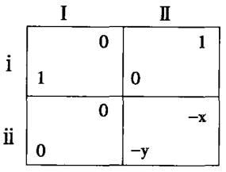

        第三部分 战略：充满随机性

        第7章 允诺和威慑的随机性
        第8章 产生随机因素的威慑

# 第7章 允诺和威的随机性

  完全冲突博弈论（零和博弈）中，随机化战略发挥着核心作用。可
以毫不夸张地说，在过去的10～15年里，随机行为因素一直是博
弈论研究的核心问题。[^7-1]在二人博弈中，随机化的本质是为了避免对方
掌握自己的行为规律，防止对方通过分析自己的行为踪迹而掌握自己的
行为规律，最终达到迷惑对方的目的。然而，在冲突和共同利益并存的
博弈场景中，随机化并没有如人们期望的那样发挥如此重要的作用，而
是完全不同的作用。[^7-2]

[^7-1]: 范·纽曼在谈及“最佳战略基本定理”——该定理认为，所有包含有限数量战略选择的零和博弈都能够使最小最大与最大最小产生均衡（“解”），如果混合战略允许的话——时说：“据我所知，所有博弈理论都是建立在这一定理基础之上的……我认为，除非“最小最大定理”得到验证，否则任何研究成果都毫无意义。”（“Communication on the Borel Notes”，Econometrica, 21 : 124~125 [JAnuary 1953]).

[^7-2]: 然而，有人可能将零和博弈中的混合战略看做是将战略持续性引入非连续博弈的手段，从而赋予后者重要的完全战略鞍点。但是，和博弈中的混合战略与非零和博弈中的混合战略并没有区别。一方可能通过掷币来阻止对方准确地猜测是正面还是背面。一方也可能采取中庸战略，通过掷币来平衡正面与背面的概率。两种方式都有效。如果第二种方式过于复杂，那么一方可以更好地切中问题的本质并展现给选手。第一种方式提醒我们，这一问题（尽管引入随机化）仍然能够阻止对方预期判断出我们的实际战略选择。决策机制、决策的记录和沟通程序，以及随机过程的结果要求的任何前期准备必须避免对方情报人员的接触。

  在那些博弈场景（非零和博弈）中，随机化的主要任务并非防止对
方预测自己的战略。正如前面所提到的，在那些博弈场景中，一方不是
想尽办法掩蔽自己的战略，而是努力使对方准确无误地预期判断到自己
的战略。

  当然，在一些规模更大的博弈场景中也可能存在零和博弈选手。尽
管有限战争中，一方或许关心能否与对方进行有效的沟通，而非掩蔽自
己希望对方关注的有限条件，但是在那些有限条件中，一方也可能通过
随机方式为自己的飞机诡辩，从而最大限度地迷感对方。[^7-3]双方可以进
行有限信息的沟通，并在此基础上达成有限协议，但是双方谁也不能将
信息完全告诉对方。以军控协议为例，军控条约必须在双方有限技术手
段监督下实施，才能向双方展示彼此的军事力量是否遵守了条约，从而
避免一方采取突袭行动。

[^7-3]: 在某些特殊情况下，双方之间通常面临保密与沟通的两难境地。如果双方为了表明自己实施威胁的决心和能力，那么他必须以事实向对方证明。当然这些事实也可能向对方传递有利于其抵制威胁的信息。例如，假设我们希望向对方证明自己的新式武器超越对方的防御能力，那么我们必须向对方展示新式武器或其一部分，或者提供技术资料证明武器的性能。这样虽然对对方产生了威慑，但同时也有助于对方提高自己的防御能力。假设我们希望在某个地区展开一场地区性战争，那么我们必须提前将部队派往该处，这无疑为对方提供了战斗的具体地点，从而避免对方大海捞针，四面出击。

  但是，随机化在传统的零和博弈中却发挥着截然不间的作用。随机
化的主要任务就是分配不可分配的对象和促使不相称的对象和睦相处。
当随机化实现这一目标时，往往采用抽签方式决定双方应得的“预期价
值”（expected values）。我们可以掷币决定谁将拥有分配的对象；如果
这也做不到的话，那就只能以“双赢或零”来决定。当我们希望从一批
合格者中选拔优秀人才进行长期服兵役时，我们可以通过抽签公平地分
配公民义务，选择被征召的入伍者。

  发挥这种作用的随机化显然与允诺存在密切联系。如果需要允诺的
价值供大于求或不可分配时，那么抽签方式则有可能使允诺的预期价值
大大缩水，当然也可以降低允诺主体的承诺成本。对一个人而言，危难
之时得到的帮助允诺与一点点实际帮助一样具有重要的意义。（如果提
供的帮助正是对方危难时所必需的，那么雪中送炭的效果将更佳。）

  但是，允诺在这一方面与威胁不同。不同之处在于，前者成功时需
要付出高昂代价，而后者失败时才需要付出代价。一个成功的威胁就是
不需要付诸实施的威胁；与此相反，作为一种诱导，如果我允诺的部分
超过我必须付出的，那么允诺就是成功的，因为我的实际付出远远超过
必须做的部分。但是，威胁的代价看起来不是有些高昂，而完全可以用
奢侈来形容。如果我威胁殴打并折磨我们，你也许会继续顺从，因为我
既不会折磨我们也不会杀死我们，这个错误没有造成任何损失。假设我
现在只有一个足以将我们大家炸死的手榴弹，但是我只想使用催泪弹，
那么如果你还不顺从，我只能被迫将威胁使用手榴弹降到威胁使用催泪
弹，因为威胁手榴弹可能走火将我们一起炸死。但是在允诺情景中，这
样的必要性并非如此明显，因为允诺的价值也可能丧失殆尽。

  如果做出威胁承诺与实施威胁的成本相同或大规模威胁的成本远远
大于小规模威胁，那么，威胁的程度就成为一个必须考虑的因素。如果
威胁使用催泪弹已经足以达到目标，那我也就没有必要再威胁使用手榴
弹；如果使用催泪弹比使用手榴弹成本更低，或者我必须展示手榴弹以
增强威胁的效果，那么，最好还是选择使用催泪弹。但是，当手榴弹成
本更低时，那就另当别论。

  有趣的是，大多数威胁的最大成本是不得不实施威胁，普通意义上
的“成本”则往往并不是决定性因素。

## 失败的风险

  失败的风险迫使威胁实施者往往选择比较保守的威胁方式。假设必
须以恐怖方式进行威胁，那么威胁方更倾向于采用抽签方式——仅仅威
胁可能采取某种行为，除非对方接受自己的条件，而不是承诺一定会采
取某种惩罚行为。



  为了方便理解，这里我们引入一个矩阵图7-1。在图7-1 中，列首
先选择，行有权对列实施威胁从而达到影响其选择的目的（X，Y均为
正数）。一种情况是，如果列选择列II，行将以行ii威胁列。如果行没
有威胁列，那么，列知道自己选择II，行就会选择ii。如果行对列实施
了威胁——假设行做出了威胁承诺，列知道这一威胁的存在——那么，
列选择II对双方都没有好处，则列更倾向于选择列I。

  现在的情况是，行认为绝不会发生对自己不利的情况，即使是自己
完全误解了列的意图。正如图中所示，列的选择也许会与大多数人的选
择相同。然而，拥有完全不同偏好的少数人可能更倾向于右下格而非左
上格。同样，行可能做出了威胁承诺，但是却没有将这一信息准确地传
递给列，并使其相信在这种情况下，列将会错误地忽视这一威胁的存
在，做出错误的选择，从而导致对双方都不利的结果出现。同样，列也
可能按照自己的承诺选择II，但是却没有及时准确地将这一信息传递给
行，那么，行就不可能知道列选择了II。在这种情况下，行的承诺只能
造成两败俱伤的结果。总而言之，无论何种情况，威胁都有失败的可
能。如果我们将这一因素考虑在内，那么行就有充分理由相信，右下格
的收益或许并非那么不利。

  如果行将自己已局限于“完全”战略——假设行能够准确无误地做出
威胁承诺——那么，行只能期望右下格中的结果具有积极意义。但是，
如果行将其威胁随机化，那么，他就能将自己的威胁成本降到某个具体
水平。例如，假设行威胁列，如果后者选择II，前者就不一定选择ii，
而有可能选择i。这样，他就可能以更小的威胁成本实现自己的目的，
即迫使列选择I。

  我们还可以进一步向大家具体解释。P代表威胁挫败的可能性，不
管出于什么原因。（为了易于操作，我们将P设为自变量，并且不受行
的战略选择的影响。）π表示行的威胁选择ii，如果列选择II的话。换
而言之，如果列不服从行的威胁，那么行的选择将对双方都不利。所
以，为了实现双赢，列只能选择i。那么，行选择的π的值究竟应该为
多大最合适？

  首先，π的值大到什么程度，威胁方才能取得完全成功（排除P因
素的影响？现在面对π，列遇到了个难题：如果列选择I，那他将
得到0；如果列选择II，那么结果可能是1和-X的平均值，两个砝码
分别为（1-π）和π，这对其非常有利。如果1和-X的平均值小于0,
那么列可能选择I（受P的影响）。尽管如此，列还是会选择II。威胁
的成立条件是：[^7-4]

```
    0 > (1-π)-πX

    π > 1 / (1+X)
```

  其次，我们假设由前面公式得到的威胁可能受（1-P）的影响而成
功，也可能受P的影响而失败。如果威胁成功，行的收益将是+1；反
之，如果失败，其收益则为0和-Y的平均值，两个码分别为（1-π)
和π。当威胁条件充分有效时，结果为：

```
    (1-P) + P(0 - πY) = 1 - P - PπY
```

  显然，这个值过大，而π相对过小。因此，为了满足第一个条件，
行应该选择π。要使威胁值得一试——即行不实施威胁时所期望得到的
收益，期望值大于零——那么π的值应为：

```
    1 - P - PπY > 0
    或
    (1-P)/P · 1/Y > π
```

[^7-4]: 由于上面的分析仅仅建立在双方绝对结果之差的基础之上，因此没有强制双方将自己的优先选择为+1，第二个优先选择为0。1/(1+X)的完全理解应该是：（1）与（2）的对比。（1）为列的右上格结果与左上格结果之差；（2）为（A）列的右上格结果与左上格结果之差与（B）列的右下格结果与左上格结果之差的总和。公式的简化反映了采取尺度表示法的优势，因为仅仅一个变量足以表示3个值之间的关系。（后面的问题将涉及左下格，而且4个结果相互联系，因此需要两个变量。但是，如果左下格结果等同于其他中的个，那么仍然可以说明问题。我们将得到非完全信息，更多的结果是0 和1。）详见 A.A.Alchian，“The Meaning of Utility Measurement,” American Economic Review，43: 26~50 (March， 1953)，或者卢斯和雷夫的案例，Pp，12~38。

  因此，Ⅱ的有效区间为：

```
    (1-P)/P · 1/Y > π > 1/(1+X)
```

  如果在二者之间没有空间，那就完全没有必要实施威胁。

```
    (1-P)/PY            1/(1+X)
    或
    P/(1-P) > (X+1)/Y
```

只有当小于1时，才有必要实施威胁。

```
    (1-P)/PY < 1
    或
    P/(1-P) > 1/Y
```

  在这个案例中，犹豫不决的威胁优于坚定不移的威胁，而且这里根
本没有必要做出一成不变的威胁承诺。问题的焦点在于威胁存在失败的
风险，并且这一风险不受假设变量π的影响。这一假设确实有些特殊。
如果我们假设P代表我们可能误解对手或夸大其选择右下格的几率，那
么这一假设意味着人口收益呈现双峰分布。同时，这也意味着矩阵中的
数字充分表明了一方的收益或另一个人的收益差距如此之大，以至于没
有任何威胁能够消除这一差别。相反，如果我们假设右列与左列的结果
比例表明人口收益显现振铃形分布，以及我们的对手是随机产生的，那
么，我们的威胁成功几率将随着π的波动而波动。在众多偷盗犯中，被
拘捕或被判刑的几率随着后者的几率而波动。我们上面分析的偷盗者可
被分为两类：一类是为了偷盗钱财，一定会被矩阵中的收益震惊；另一
类是为了一时好玩，他们则不会受到右下格的影响。此外，如果我们失
败的几率反映了与对方沟通的失败，那么，我们完全可以做出这样的结
论，即失败的几率不受某个成功威胁的影响。

  如果认真分析上面的案例，你会发现我们将失败的几率与威胁联系
起来，无异于直接降低威胁的效果。例如，假设右下格的X是对双方
的惩罚，或者威胁如果被实施，那么，双方都将受到鞭挞或被关进牢
房。如果X代表行可以威胁使用的鞭挞和关押的最大期限，那么，π将
代表行能够惩罚的最大有效数字。假设为0.5，则双方将均等分享应
有的惩罚。如果我们以这种方式释义收益矩阵，并质问π的值多大时对
行最有利，那么，我们就能以同样的分析方式得到同样的结论，即π的
最小值为1/(1+X)。因此，我们可以认为π表示威胁实施的几率，或一
定能够实施的威胁程度。由于两个公式得到同样的结果，我们完全可以
说，随机化在类似条件下的作用是在博弈选手之间分配一个规模过大、
具有不可分割性的威胁，或分配一个规模更小的威胁。（需要指出的
是，通过降低实施威胁的几率来削弱威胁，无疑相应减少了收益对双方
的预期价值，而且直接减少的程度并非一定要与威胁的效果和价值成比
例。）[^7-5]

[^7-5]: 随机化或许是威胁计划不可分割的一部分，或者与决策过程有着千丝万缕的联系，无论威胁方愿意与否。因此，认为随机化是控制威胁程度的手段的观点仅适应于某些特殊场景。

## 威胁意外实施的风险

  还有一个“成本”因素可以降低威胁产生的几率。这个因素就是，
威胁方可能无意识中实施了威胁，即使对方已经屈服于威胁（或者在威
胁实施之前接受威胁）。同样，在盗窃犯或受害人屈服之前，威胁他们
的手枪可能会走火。防范侵犯（他人土地）者的看门狗也能误伤无辜的
人。

  假设一个搭便车的旅行者用枪指着一个正在行进中的汽车司机，那
么，司机可能以全速行驶、人为制造交通事故来威胁前者把枪丢到车窗
外。在这种情况下，在搭便车的人充分理解司机的意图并接受其条件之
前，完全可能提前发生交通事故。由此可见，意外履行威胁的危险也是
威胁不可分割的一部分。然而，只有将威胁付诸实施才能使威胁具有说
服力，因为除非司机全速行驶，否则搭车人是不会相信司机的威胁的。
问题是，一旦司机将速度提起来后，在搭车人屈服和司机减速之间存在
一个非常短的时间差，而这个时间差正是危险的高发期。当然，在这段
时间内，高速度产生的危险或许能够被司机所控制。如果汽车速度一直
保持在60公里以下，60公里则是交通事故的临界点，那么风险系数就
不存在阶段性；在这种情况下，司机就不会轻易将速度提升到60公里。
当然，如果搭车的人知道这一情况，那他也就不会相信司机的威胁。这
样就存在“边际威胁”（fractional threat）的问题，即一方只是口头上
进行威胁，却没有采取威胁的实际行为，从而不会造成人员的伤亡。但
是为了达到威胁的效果，司机还必须得将这一切暂置脑后。

  在这种情况下，我们假设——搭车案例基本上证实了这一点的正确
性——意外实施的危险与威胁实施的几率π成正比（如果看门狗咬伤无
辜行人的几率与咬伤侵犯者的几率成正比），那么我们将得到一个与前
面公式略有不同的新公式。为了帮助大家理解，我们以同样的收益矩阵
（这次我们忽视威胁失败的可能性）表示这一公式。假设π代表意外实
施的可能性，其最小值保持不变。如果行希望进行威胁，那么他的预期
结果必须大于0，公式表示如下：

```
    (1-aπ) - aπY > 0
    或
    1/a(1+Y) > π > 1/(1+X)
```

  最理想的威胁必须稍微高于最低水平，最高水平应该小于1。而
且，这一威胁取决于X和Y以及参数a的值，或许π不存在有利的值。

## 随机性承诺

  找到了边际威胁的规律后，现在我们探讨模棱两可的无条件承诺在
某种情况下是否也是利大于弊。正如第3章和第5章所论述的，完全承
诺——完全战略承诺等同于2人、2次选择博弈的第一选择。在这类博
弈中，一方必须做出2次选择，完全承诺成为获得第一选择的手段。如
果我们假设行拥有第二选择权，但是必须提前做出选择，选择i和ii几
率各为50%，那么，我们就必须放宽这一释义。要做到这一点，一方必
须保留进行第二次选择的权利，并利用这一权利提前做出选择。如果一
方必须首先选择，那么他将失去随机承诺的机会。（选手设置的随机机
制决定了随机承诺等同于“第一选择权”，但对方可能在其做出选择之
前尚未了解情况。）

  如果我们对游戏规则进行适度修改，允许行在列做出选择之前做出
无条件承诺，而且不能受到列的影响，那么，上面的收益矩阵（图7-
1）同样适用于这一新情景。如果行选择ii，那么列很有希望选择I。
但是，这一选择对其没有任何好处，因左下格——行现在的承诺——没
有任何回报。行的问题在于其不仅要以ii引诱列的选择I，而且还要以
i从I中获益。随机承诺也可能产生折中方案——承诺做出随机选择。
如果在列做出选择后，行掷币选择（几率各为50%）i和ii，那么，只
要X大于1，列就会选择I。[^7-6]那样的话，行将得到预期的0.5。如果行
将π的值设置成大于1/(1+X)，那么只要列选择I，行将得到最大预期
收益。（如果列的收益是左下格而不是0，即0.5或-0.5，那么得到π
最大值的公式也会不同。）如果行的左下格收益为-1，那么他选择ii的
几率不会大于50%。假设这一收益是-X或更糟糕，就不可能出现i和
ii的组合。如果π的值大到足以引诱列选择I，那么，任何结果都是对
行有利。

[^7-6]: 即：只要列在右下格的结果小于左上格的结果或右上格的结果大于左上格的结果。详见前面有关结果比例的脚注。

  这是部分承诺的又一个规律。正如前面所讨论的，行更倾向于右上
格的I，从而将π的值减小到最小。在图7-2中，列期望行选择i，即
π的部分值。这样的话，行选择ii的承诺能够引诱列选择II；行选择i
的承诺将引诱列选择I。无论行怎么承诺，列都不愿意选择II。行无法
以选择i来威胁利诱列选择I，除非行允诺放弃选择ii。在这些“完全
战略”情景中，行都以收益2来结束游戏。如果行能够做出混合承诺
（mixed commitment），其收益将会更好。他完全能够做到这一点，因为
行和列同样倾向于选择I，分歧之处在于双方对行的不同倾向。如果
他选择i和ii的几率各为50%，那么，列很有可能在第一列中的2和
第二列中的1.5中选择前者。在这种情况下，行将得到2.5，因为行倾
向于ii，虽然行在选择最佳行的同时希望列选择I。因此，行希望的π
值为：

```
    4(1-π) > (1-π) + 2π
    或 3/5 > π
```

  这一混合承诺可以被称为边际威胁和部分允诺的集合体。实际上，
行可以在列选择II时以i威胁列的同时，在列选择I时做出允诺。

  如果行能够把π的值与列的选择相挂钩，行的收益将更好。假设行
在列选择II时肯定以i威胁列，那么列将选择I，行选择ii，行将得到
0.75。但是，行做出威胁承诺的收益不能低于允诺的收益——如果行做
出二者选择的几率相同——若π的有效值不能大于0.6，行将得到预期
收益为2.6（列得到的值为1.6）。由于的值不同，行做出允诺时，他
得到的预期收益为2.75（列的结果仅为1.0）。


