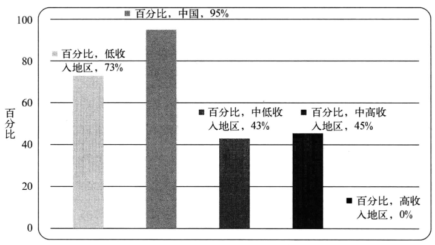
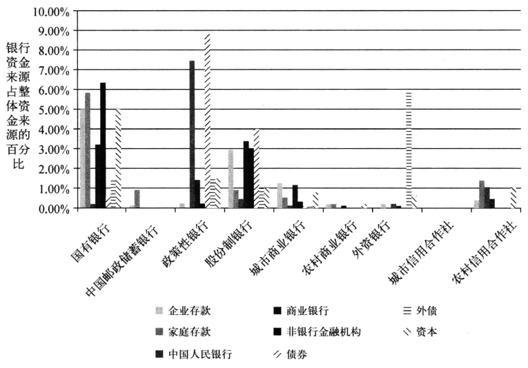
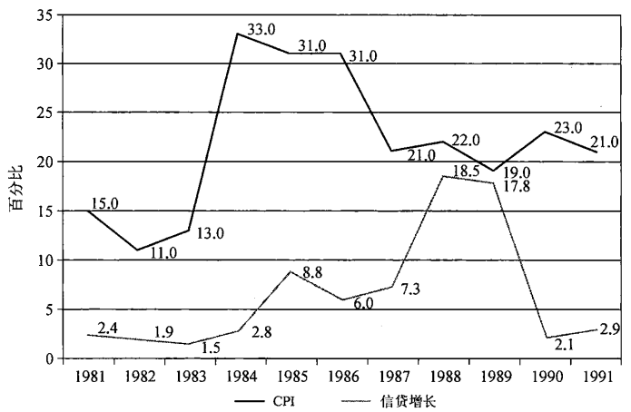
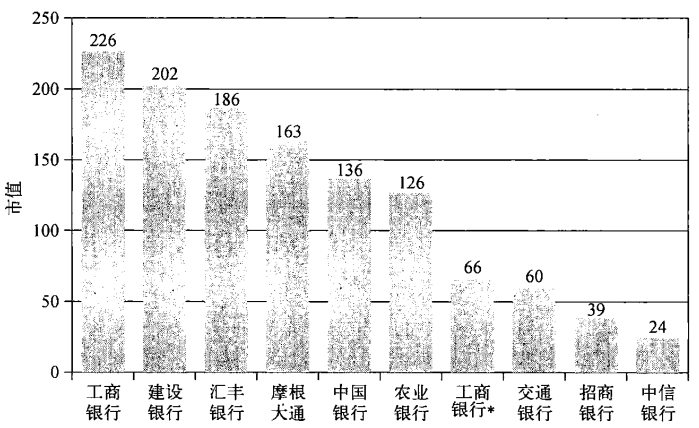
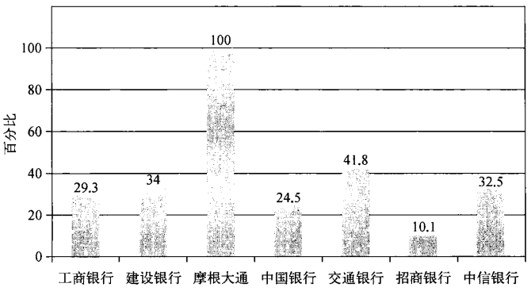
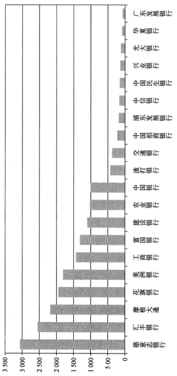
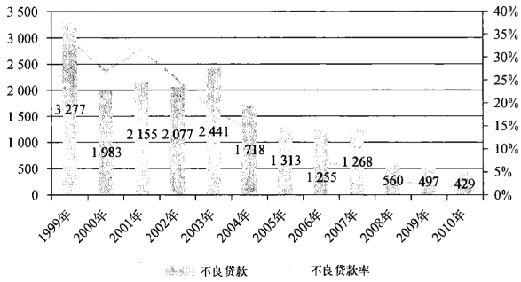
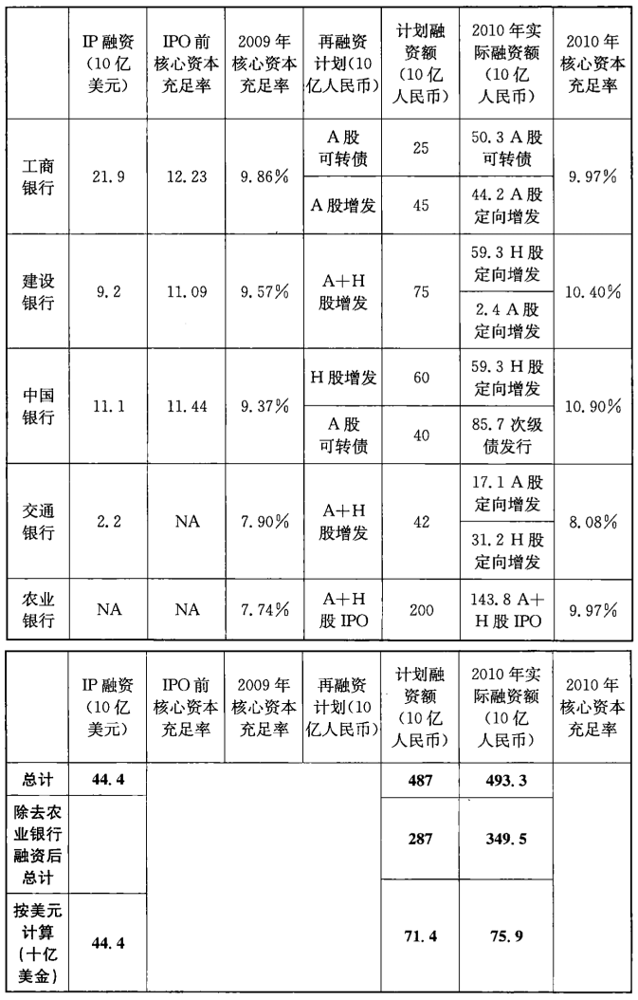

# 第二章　中国的银行堡垒

        我们不应该照抄照搬美国的东西用于中国，而是要根据
        中国的实际，来构造自己的金融体系。
        
        ——中国国家开发银行董事长陈元
            2009年7月

在中国，金融体系主要是由银行构成的，几乎所有的金融风险都集中体
现在银行的资产负债表上。勇敢的中国储户们则承担着这种风险，对于政
府所控制的“体制内”经济来说，他们是唯一重要的国内经济资金来源。这
在中国的经济和政治体系中是最薄弱的环节，国家领导人总的来说对此是
心知肚明的，这也就是为什么在过去30年的经济试验中，他们总是竭尽全力
去保护这个银行体系，让它们免于直面竞争，不允许它们面临一丝一毫的失
败风险的主要原因。尽管中国加入了WTO，但外资银行所占国内金融资产
总规模的比例，一直以来都不到2%：很显然，他们的地位根本就不重要。
除了竞争的压力之外，政府将银行视作一种基础设施，用于向其珍贵的国有
企业提供无限的资本。在党的领导下，各方面的银行风险都必须是可管理、
可控制的。

尽管如此，在过去的30年里，这些银行每到年底都会遇到麻烦。它们能
够继续正常运转的唯一原因是他们长期受到党和政府充分的、毫无保留的、
代价高昂的支持。在20世纪80年代，银行系统才刚刚被重新建立时，由于
地方政府的贷款失控导致了两位数的通货膨胀率。而1997年的亚洲金融危
机，则促使中国国内的一家重要的金融机构广东国际信托投资公
司——实际破产。这迫使政府采取了一次自下而上的银行重组，并公开承
认不良贷款水平高达40%。本次重组的起源可以追溯到1994年，当时，一
个严格按照国际标准设计的框架被勾勒出来，它包括一个独立的中央银行，
若干家商业银行和政策性银行。但是，由于随后的高通胀，1994年的尝试最
终不了了之。高通胀在1995年时达到高峰，通胀率超过20%，情形一度失
控。总之，2010年时中国的银行巨头们资本不足，管理不善，事实上，它们早
在10年前就应该已经破产了。

现在，中国的改革开放已经走过了第三个十年，在此期间，银行完成了
重组，并且各项工作都符合国际企业治理和风险管理标准。到2006年，四大
国有商业银行已成功完成海外上市。在2008年的全球金融危机爆发后，中
国的银行业表现明显举世无双。它们击败了发达经济体中那些与自己市值
规模相当的同行，甚至超过了那些在“财富500强”企业榜单中名列榜首的同
行。他们似乎已经渡过了全球金融危机。但是，与此同时，执政者面临着中
国的出口导向型经济的崩溃，于是沿用自己过去的传统做法，下令银行向困
难企业放贷，不遗余力地推动经济向前发展。政府给大规模信贷亮起的绿
灯，有可能会抹去中国的银行业在过去十多年里辛苦修炼而成的企业治理
和风险管理标准。

到2009年年底，中国的银行系统共借出超过9.56万亿元人民币，约合
1.4万亿美元，资本充足率几乎降到国际标准的最低水平。在2010年，这些
银行都争先恐后地寻求巨大的新的注资，总额超过700亿美元（包括中国农
业银行的IPO）。未来不难预见，2009年的贷款盛宴肯定会产生问题，由于
贷款的规模过大，在以后两到三年内，中国的银行也可能会出现第三次资本
重组。表面来看，中国的大型国有银行，金融业的“国家队”，面临的情况似
乎和1998年没有什么不同，但事实上，他们面临的问题比1998年更严峻。
自20世纪90年代以来老的“问题贷款”并没有被清扫，只是被掩盖到了地毯
下面而已。那些承接不良贷款的“坏银行”（即四大资产管理公司）其资产结
构不良是显而易见的，那些剥离了不良资产的“好银行”，最终则依然要对其
不良的后果承担一定的责任。中国政府倾向于采用制定临时政策、使用专
项资金的办法来无限期推迟兑现银行的亏损，而拒绝外资参与信贷市场。
这些，中国的银行业早在2009年、2010年以及2011年大幅积累不良贷款之
前，就已经极大地制约着中国的金融实力。

中国的银行看起来很强大，实际上是脆弱的。就这一特征而言，它们与
中国本身的特点是如此相似。在过去的很长一段时间里，中国人都十分注
重表面功夫，并且对于掩盖深层次的问题十分在行。他们以往的经验告诉
他们，这种策略是有效的。但是，与以往任何时间的情况不同的是，中国目
前已经置身于一个更开放的广阔世界中。如果没有金融体制国际化的改革
背景，或许就不会有广东国际信托投资公司的破产。同时，中国的金融体系
自身也变得越来越复杂。这种复杂性已经开始侵蚀政府当局传统的解决问
题的有效方法，那就是，简单地将钱从一个口袋转移到另一个口袋，然后把
剩下的问题交给时间去解决，让人们逐渐淡忘掉所有的事情。这是一个百
般纠结的金融疙瘩，仅仅依靠整个体制的经济规模、覆盖范围和看似无限的
资本，是不能彻底解决银行问题的。

## 银行就是中国的金融体系

在中国，四大国有商业银行是资本的起点和归宿。如果包括12个二线
银行，城市和农村银行，邮政储蓄银行，信用社，整个银行体系包含数千个实
体。但核心的系统只有四个：中国银行（BOC），中国建设银行（CCB），中国
农业银行（ABC），以及最大的中国工商银行（ICBC）。2010年，国有控股商
业银行持有的金融资产超过15万亿美元，其中四大国有银行就占了60%以
上（见表2－1）。这四家银行控制了中国金融资产总额的45%。

表2－1中国相对控股的金融资产,2009财年

单位：万亿元（人民币）

人民币         2006年   2007年   2008年   2009年   2010年
--------     --------  -------  ------  -------  -------
人民银行        12.86    16.91    20.70    22.75    25.93
各大商业银行    43.95    52.60    62.39    79.51    95.30
证券公司*        1.60     4.98     1.19     2.03     1.97
保险公司         1.97     2.90     3.34     4.06     5.05
                60.38    77.39    87.62   108.35   128.25

注：*包括证券公司和基金管理公司

资料来源：中国人民银行，《金融稳定报告》

金融资产集中在银行系统，这是所有落后的低收入经济体最典型的特
征之一（见图 2－1)[^2-1]。不同之处在于,在中国的情况下,中央政府对于各个
部门的控制是不可动摇的。相对的，外国银行持有很少超过两成的金融资
产总额（只有1.7%，还是经历了2009年后的贷款盛宴以后），相比国际近
37%的水平，实在是太低了。这样的情形不会很快改变。一个非常高级的中
国银行家曾在2010年年初被问及中国政府对外资银行的战略，他表示对外部
门的相对开放可能还需要五年左右时间。他说：“我认为并没有很多人会想到
这一点，实际上我希望在未来五年的时间里，外资银行的金融资产总额可能会
达到2%到3%这样的水平。”尽管有过去30年的改革开放，尽管有WTO协议
的要求，但是中国的金融业仍然是在北京的双手中牢牢控制着。其实，通过资
产多样化以分散金融风险，在政治上应该也是可以接受的。

[^2-1]:［美］埃斯里·德米尔古克·肯特（Asli Demirguc-Kunt)，罗斯·莱文（Ross Levin)：《金融结构和经济增长》(Financial Structure and Economic Grouth）,MIT 出版社，2004 年版，第28页。

注：国有商业银行所控资产在所有商业银行资产中所占的比例，41个国家的数据。

资料来源：基于埃斯里·德米尔古克·肯特（AsliDemirguc-Kunt)和莱文（Levine)的数据进
行整理（2004年）

当我们讨论中国大规模的增量融资的时候，如果仅仅关注到中国香港、
上海以及深圳的股票市场，那就像蜻蜓点水一样肤浅，是完全不够的。事实
上，为中国国有经济的引擎高速运转提供资本动力的是大规模的银行贷款
和债券的发行。例如，2007年对于中国股权融资是破纪录的一年：那一年，
中国国内通过股权进行融资的规模超过了1230亿美元，然而，同年银行新增
的银行贷款总额为5300亿美元，而债券市场融资金额也达到了3550亿美元。
过去的十年中，中国国内通过股权市场进行融资的比例在包括贷款和债券在
内的所有融资总金额中只是个位数。那么，究竞是谁承销并且持有这些固定
收益债券呢？是银行！它们持有的债券总额超过70%以上，包括财政部发行
的债券。如果看得更深远一点，我们会发现，那些在一级市场寻求投资的机
构，它们的资金也有很大一部分来自于银行信贷。在中国，银行就是一切。这
一点中国的当局者十分清楚，对于它来说，银行系统既是武器，又是盾牌。

## 中国的银行都是大银行

正如我们所说的那样，中国的银行体系为我们展现了一幅极为复杂的
图像，就如美国的体系那样。中国的银行体系包括：五大国有商业银行（工、
农、中、建、交），三家政策性银行，12家中等规模的银行，也就是人们所说的
股份制银行，一家邮政储蓄银行，147家城市商业银行，85家农商行，223家
农村信用合作社，63家信托投资公司，一系列的金融和汽车租赁、货币经纪
公司、财务公司，40家地方性的外资银行子公司，当然，还包括至少4家大型
资产管理公司。这一共总计3769家金融机构，拥有大约19600个分支机构
和网点，以及300多万名员工。

但是这幅图像是十分误导人的，因为只有四大国有商业银行外加交通
银行是重要的。这五大银行持有了59%的政府债券，85%的央行票据，以
及44%的所有公司债务。它们为其他银行提供了32%的银行间拆借和固
定收益融资，并为其他非银行金融机构如保险公司和信托公司提供了
76%的融资服务。相比而言，另外12家股份制商业银行，如招商银行、中
信银行等，只持有17%的政府债券，提供了21%的企业融资，以及25%的
银行间拆借。

如果我们从银行融资来源的角度去看一下中国的银行体系（见图2－2）
就会发现：工、农、中、建、交五大银行拥有了58%的家庭储蓄，50%的企业
储蓄，并且在整个金融体系中其资本拥有半壁江山。而股份制银行则拥有
29%的企业储蓄，9%的家庭储蓄，这使得它们过度依赖银行间市场，因此它
们接受了34%的银行间拆借和30%的来自非银行金融机构的借款。它们看
上去资本十分不充足，仅仅占有整个金融体系资本总量的10%左右。

在这里我们就能看出农村商业银行和信用合作社的整体价值了。它们
掌握了16%的中国家庭储蓄。如果把它们和同样注重农村市场的中国邮政
储蓄银行放在一起来考量，那么这个比例就达到了26%。其实很多人不知
道的是，这些不知名的金融机构成为了中国金融体系流动性的重要贡献者。
当然还要注意的是，中国国家开发银行比较特殊：它的融资主要依靠债券发
行（比例占到总额的88%)和中央银行贷款（比例占到总额的75%），我们将
在第五章为大家详细介绍。

注：单位为百分比

数据来源：中国人民银行，《金融稳定报告》，2011年

## 危机：刺激银行改革，1988年和1998年

今天的银行系统是中国国内金融危机的产物。中国国内的金融危机
始于中国三十几年前的改革开放初期，并持续了20多年的时间。1976
年，当“文化大革命”结束的时候，中国几乎没有现代意义的银行系统和金
融机构，北京面临着金融体系设计构建的问题。当时的领导人很自然地将
目光投向了苏联的金融体系模式。这种模式可以描述为，一个大的统筹计
划之下的财政部以及几个小型的银行，主要做一些短期的资金借贷业务。
中央银行的作用没有突显。最重要的一点是，当时的银行不是由北京统一
进行管理，而是由各个省级党委、政府管理，满足地方政府对资金的需求。
在1980年代末，这种模式发展成为放贷狂潮，最终结束于通货膨胀。1992
年，邓小平在深圳发表的讲话将整个经济和银行系统直接拉回到了
1988年以前。当时中国经济出现了巨大的泡沫，随之而来的是泡沫破
裂，最明显的例子就是1993年海南的房地产市场泡沫的破裂（本章后面
会提到）。

为了配合中央政府在1990年做出的关于建立股票市场的决定，到1994
年，北京放弃了苏联的银行模式，转而学习美国的金融发展经验。根据新的
银行法规和会计规则，中国政府建立起广一个独立的中央银行，并且开始着
手四大国有商业银行的转型。同时，建立了三家政策性银行持有非商业性
贷款。但是由于朱镕基总理将控制通货膨胀放在首要位置，这一努力的目
标当时未能实现。直到1998年亚洲金融危机的发生，以及广东国际信托投
资公司的破产，才使得中国的银行系统的改革重新回到了1994年开始铺设
的道路上来。

中国的国家领导人，不管是现任的还是已经离任的，他们都明白：一个
国家的金融机构对于其金融和社会稳定有着巨大的意义，如果金融机构出
现问题，那么将极大地威胁中国的金融和社会稳定。同时，他们还不十分清
楚应该如何减少金融机构对于稳定的威胁。对于中国政府来说，管理和控
制是一种传统。而对银行系统来讲，如果缺乏控制，就会发生新的危机。为
了实现对金融机构的管控，从1998年，朱镕基和他的团队采用了更为先进和
复杂的办法。就像他们在改革国有企业时做的那样，这个团队试图采用国
际公司治理和风险管理方法，创造一个更为独立的银行系统。这次改革的
主要决定就是，让中国的金融机构赴中国香港上市而不是在上海上市，这样
就能够将银行系统的监管交给国际监管机构、审计机构、投资者和法律机
构。事实上中国的银行业在20世纪80年代和90年代的经历已经能够清楚
地表明朱镕基总理为什么会做出这样的决策，而2009年中国银行业发生的
事情则更进一步地说明了这个问题。

## 20世纪80年代的扩张

中国的经济1977年前曾一度濒临破产，当时的商业机构和政治机构一
样，留下的是一大堆烂摊子。那时的中国几乎没有现在所谓的国家经济，事
实上只是集合了地方政府所有的资产而已。那么用什么样的战略才能够让
这些资源重新聚合在起呢？如果我们回顾1949年的革命，我们会发现，当
时的中国试图建立起一个中央统一计划下的体制，这套体制的建立采纳了
20世纪50年代苏联专家的建议。但是如果我们把这段时间分析一下，我们
可以发现在20世纪50年代中国经历了一场反右运动，这场运动使得整个经
济体系的建设只有开始，而后半途而废。从1957年至1962年，中共和苏联
的关系发生恶化，苏联方面撤回了大批专家。在高成本的所谓“大跃进”运
动期间，毛泽东曾一度“退居二线”，但他很快又回来了。1966年国家进入了
漫长的“十年动乱”时期。

在当时那样的混乱时期，实行计划经济体制的中国，怎么能够保证经济
计划的到位和正确呢？不管这个问题的答案是什么，在1976年粉碎“四人
帮”之时，中国并没有什么银行体系，所有的事情都需要重新规划、重新建
立。而当时人们唯一所知道的经济模式就是当初苏联专家留下的苏联模
式。在1978年开始实行改革开放的时候，中国只有一家银行，就是中国人民
银行。那时的人民银行只是财政部的一个部门而已，总行只有80多名员工。
而就是从那时开始，一个爆发式的金融机构改革开始了！

政府对于建立新的银行和非银行金融机构有着广泛的积极性和热情，
因为他们认为这是金融现代化的表现（见表2－2）。到1988年年底，全国就
有了20家银行机构，745家信托投资公司，34家证券公司，以及180家典当
行和不计其数的融资公司，正如雨后春笋，遍地发芽。每一级政府都建立了
他们的金融实体，就像我们现在所说的地方融资平台一样。因为在当时，什
么东西只要和“金融”挂上点边儿，就能轻松地召唤巨大的财富。

表2－2 20世纪80年代中国出现的金融机构

&nbsp;  机构类型                                成立日期
------  -------------------------------    ------------
1)      20家银行机构：      
        中国人民银行                           1978年1月
        中国银行                               1978年1月
        中国人民建设银行                        1978年8月
        中国农业银行                            1979年3月
        中国工商银行                            1984年1月
        中国投资银行                            1994年4月
        厦门国际银行                           1985年12月
        邮政储蓄                                1986年1月
        嘉华银行                                1986年4月
        城市信用合作社                          1986年7月
        爱建信托银行公司                         1986年8月
        温州市鹿城城市信用合作社                1986年11月
        交通银行                                1987年4月
        中国招商银行                            1987年4月
        中信实业银行                            1987年9月
        烟台住房储蓄银行                        1987年12月
        深圳发展银行                            1987年12月
        丰富住房储蓄银行                        1987年12月
        福建工业银行                            1988年8月
        广东发展银行                            1988年9月
2)      745家信托投资公司：
        中国国际信托投资公司                    1979年10月
        中国工商银行信托                         1986年4月
        沈阳市信托投资公司                       1986年8月
        中国农业信托投资公司                      1988年
        中国银行信托投资公司                      1988年
        中国经济发展信托                          1988年
        广东国际信托投资公司                    1980年12月
3)      34家证券公司                              1988年
4)      180家典当行                           从1984年开始
5)      未知数量的融资公司                     从1984年开始

早期复兴伊始，几乎没有什么专业人才，因此银行就不得不沦为政府的
一个附庸。在当时,政府曾专门印发了个文件来明确规范银行的职责，即
中央银行和专业性银行的工作应该着眼于客观经济发展、货币政策稳定并
且提高社会生产力。这句话将经济增长和稳定货币相提并论，但在政府的
眼中，前者将永远占主导地位。更严重的是，这种制度设计有一个基本缺
陷，那就是银行组织实际上成了地方政府行政系统的一部分。虽然当时央
行已经成为了国务院的一部分，但是它的关键办事部门都在其省一级机构，
而在那里，他们会受到地方党委的控制。在整个20世纪80年代至90年代，
地方党委不仅控制着当地商业银行系统官员的任命，更控制着当地人民银
行官员的任命。当然，地方政府对银行系统管理的这一偏好会一直存在，因
为这样可以更加容易获得本地发展所需要的资金。而这一切的后果则是在
80年代后期发生的严重通货膨胀，加之训练不足却热情有余的工作人员，那
时的政府无异于是在“玩儿火”。

正如在2009年这些机构慷慨地放贷一样，在20世纪80年代后期，官方
公布的通货膨胀率达到近20%（见图2－3）。加之各种行政手段的强刺激：
在当时的一些地方银行，开始出现了挤兑的情况。通货膨胀、腐败和缺乏领
导经验，最终在1989年酿成风波。经过1989年和1990年的严厉整顿之后，
好戏终于重又拉开了大幕：1992年邓小平在广东视察并且做出了一系列的
讲话，而在那时，中国的金融体系也开始失去控制。海南房地产泡沫的破裂
就很能说明当时的问题。

资料来源：《中国统计年鉴》；《中国金融统计》，1949一2005年。

## 海南房地产泡沫

1988年4月6日，海南省经济特区成立。当时的海南和现在大不一样，
还不是一个超五星级酒店汇集、时尚名模趋之若鹜的地方。这里只是一个
落后的热带岛屿，有一些自然资源和美丽的风景，它的地理位置在中国南海
的石油和天然气田附近。然而，由于北京的决定，它竟然在很短的时间上演
了中国版的“狂野的西部”（Wild West）。在经济增长的承诺和预计将产生
超过30个优惠的投资政策的吸引之下，数十万热血青年涌向海口和三亚。
这些政策鼓励发展出口产业，同时导致酒店、娱乐业的兴旺，当然还包括房
地产市场的蓬勃发展。

如果说深圳因为靠近中国香港而成为最具西方色彩的经济特区，那么
海南就是纯粹的中国版本。这个岛屿面积在中国仅次于中国台湾的地方，当
时金融也还是一片空白，但21家信托投资公司竟然一夜之间就冒了出来。在
海南，信托公司就是银行。在这片中国经济的处女地，竞争是异常激烈的。当
时没人会去关心什么出口行业。每个人对自己的机会都心知肚明：房地产。
在中国，房地产可是一个永恒的主题。信托公司的特殊地位,加之土地使用权
的买卖转让，创造了爆炸性的获利机会。突然间在海南出现了两万多个房地
产实体，平均每80人一个地产公司。在三年内，房屋价格翻广两番。

海南房地产热潮的催化剂来自海外：日本的熊谷组在海口获得了30平
方公里土地的70年租赁合同。熊谷组后来在亚洲金融危机时破产。让我们
来想象一下这样一笔交易：一家公司将港口开发用地转作为住宅开发，以每
亩300万元人民币的价格出售了900亩的土地。而在当时，工业用地只售每
亩13万元至15万元人民币，哪里还有什么商人会去发展港口建设！在这样
的机会前提之下，有人说要买下海口的每一寸土地就不是一个狂妄的空想。
在1992年，使海南得到快速致富的商业模式很快蔓延到了整个国家，这一
年,似乎一切皆有可能。

随后在1993年，朱镕基总理开始努力控制管理国家的经济，特别是房地
产行业。下金蛋的鹅突然没有了，投机者们作鸟兽散，留下了600多个烂尾
工程和价值300亿元人民币的坏账。当时，单纯这一个经济特区的坏账就相
当于全国财政预算的10%，占全国坏账总额的8%。这就是所谓的富有创造
性的中国地方融资平台。在2010年，在中国每一个省的省会城市都在发生
着同样的事情，政府在利益的驱动下大肆推动银行贷款。海南房地产的崩
溃直接导致了在1994年政府第一次试图努力推行“好银行和坏银行”改革。
作为一系列改革措施的一部分，中国政府建立了三家政策性银行，包括现在
著名的中国国家开发银行（CDB)，负责政策性贷款而非商业贷款。与此同
时，四大银行则要成为完全商业化的机构。然而，这一现代化大银行的战
略，从来没有得到有力的推动，直到1998年时广东国际信托投资公司破产。

## 广东国际信托投资有限公司

海南房地产危机的爆发只是中国系统内部自身的原因，而广东国际信
托投资公司的问题就不那么简单了，因为当时广东已经暴露在全球经济的
大环境之中。广东国际信托投资有限公司在1998年的破产对中国构成了真
正的威胁。这件事情可能早已被人遗忘。那时，广东国际信托投资公司接
受广东省委管理的方式与现在金融机构受监管和管理的方式不一样。在最
近的2008年，强大的中信泰富通过纯粹的投机交易和未对冲的外汇对赌，烧
掉了超过20亿美元（之后不得不重新接受注资）。广东国投事件发生的时候
整个亚洲都在经历金融危机。尽管当时，面对金融危机中国显示出了平静
的姿态，但那时的广东也面临着出口下滑带来的巨大打击。广东省是中国
与世界联系最为紧密的地方，是国际贸易和境外投资的重点地区。在那时，
也就是十几年前，中国的外汇储备只有1450亿美元，而外债高达1390亿
美元。

广东国投的破产,是迄今为止第一个也是唯一一个正式在中国申请破
产的主要金融机构，这次事件的爆发，促使党和政府下决心进行金融制度改
革。这件事情也引发了针对中央政府作为重要金融机构背后支持的承诺的
质疑，当然不是针对其能力的质疑。在20世纪90年代的时候，广东国投曾
是全国最大最重要的信托公司，也是作为广东，当时最为富有的省份的国际
借贷的窗口。1993年广东国投在美国首次也是唯一一次发行1.5亿美元债
券的时候，穆迪和标准普尔对广东国投给予了和财政部同样的信用评级。
广东国投的高层管理者在外资银行家中十分出名，因为他对于参与跨境外
汇交易和衍生产品市场非常积极。广东国投的一家子公司也在中国香港上
市，并且成为了《商业周刊》的封面故事。[^2-2]那时，外资银行家们都喜欢和他
们“亲密”的朋友黄炎田主席在广州60层高的会所中品尝红酒。广东国投是
当时的“国家队”老大，是所有国家队员的鼻祖。

事件的爆发对于管理不善的公司来说都如此的相似，时任总理的朱镕
基开始觉察到，道德风险对于金融系统威胁极大。在这一点上，政府的做法
和2009年发生的事情相比有很大的不同，这一点我们在后面还会谈到。广
东国投破产的直接原因是1998年无力偿还1.2亿美元外国贷款。朱镕基当
时对于此无法估量的财务损失十分愤怒，当即责令广东省政府1998年10月
关停广东国投。1999年1月，广东国投被宣告破产，国际金融界认为这对于
中国是一个巨大的冲击。于是各种传言开始迅速传播，无论是在国家的内
部和外部，人们都认为“中国商业银行在技术上已经事实破产了”。这些具有
一定威胁意味的断言迫使朱镕基总理在1999年3月的全国人大新闻发布会
上向记者作出以下澄清：[^2-3]

        “我觉得那些债权银行以及某些金融机构对这个问题的估计太悲
        观，就是认为中国已经发生了金融危机，没有支付能力，不讲信用。中
        国经济保持快速发展，现在有1465亿美元的外汇储备，国际收支是平衡
        的，完全有能力偿还债务，问题是这种债务是不是应该由政府来偿还。”

[^2-2]: 细节请参考"红色资本主义世界：黄炎田的金融发电厂正在改变中国”，《商业周刊》，1994年5月。
[^2-3]: 李利明，曾人雄：《1979一2006：中国金融大变革》，上海人民出版社，2007年9月版，第474页。

鉴于国际的关注，以及加强金融监管的愿望，朱镕基下令广东国投按照
国际标准进行破产。国际知名会计师事务所毕马威负责对广东国投进行破
产清算，整个破产过程公开透明。针对广东国投的调查要比之前针对国内
任何一个金融机构的调查都要公开彻底。这是一起值得被记录的公众事
件，不应该被遗忘。其失败的规模是十分惊人的。毕马威会计师事务1999
年4月所做的初步财务审查发现，当时广东国投拥有260亿美元的总资产，
但负债已高达440亿美元。在长达四年的破产清算过程中，494个债权人索
赔共计560亿美元，其中470亿美元归属于320个外国债权人代表。

最后，广东国投的债权人所面临的事实是，90%的公司贷款和承诺是永
远不可能得到偿还的。广东国投在全省投资了超过105个股权投资项目，超
过80%的项目都失败了，没有任何价值。广东国投本身的破产回收率
(Recovery Rate)是12.5%，而它的三个主要子公司的回收率为11.5%至
28%不等。当我们把事件逐渐展开的时候，我们会越来越震惊。这些数以
亿计的美元最终都去哪儿了呢？答案是，许多广东国投所投资的房地产和
基础设施项目仍然存在，但现在他们都在政府所拥有的其他口袋里。

今天，在2010年，央行官员和监管机构正准备爽快地承认，许多在2009
年的贷款项目并没有产生直接的现金流，如房地产和高速铁路的项目等等。
即便如此，他们会继续认为，在未来这些基础设施投资将会产生很大的价
值。他们现在所描述的就是广东国投当时的融资模式。唯一的问题是：哪
一个公司将最终接下这个不良贷款的接力棒？

然而，在1998年，朱镕基对不良贷款并没有采取如今这种乐观的看法
的。广东国投的破产导致了全国数百个信托公司和农村信用社的关门。更
为重要的是，在那之后，中央政府开始着手进行四大国有商业银行的改革，
使其直接受中央的管理，并且开始了金融体制改革。朱镕基明白：如果广东
国投是一场金融风波，那么其他国有银行又有什么不同呢？答案当然是：没
有。从那之后中国就开始了以美国金融体系为标准的大刀阔斧的银行体系
改革。在当时看来，美国的金融体系是世界上最为先进的。

## 2010年中国的银行堡垒

总体来说，中国的整个银行业经受住了2008年金融危机的打击，这是对
当时朱基所要求的改革的一个见证。虽然在发达国家，许多主要银行都
在2008年的金融危机中宣告破产，而中国的银行业似乎并没有发生太大波
动，反而有人认为，中国银行业的实力得到了一定的增强。中国在上海和中
国香港交易所上市的银行中，有六家入列“全球财富500强”。中国工商银行
就是其中之一，它的市值全球第一，同时它也是世界第二大的公司，仅次于
埃克森美孚（见图2－4）。相比之下，美国目前最强的银行摩根大通，以第19
名的成绩远远落后。而就在1998年的时候，中国的银行业不良贷款率超过
40%，在那时看来中国的银行面临的改革之路多么漫长遥远啊。

注：*经彭博资讯调整

资料来源：彭博资讯

而事实上，十年后的今天，中国的银行业更强大了，它的工作人员也更
加专业。中国银行业的高级管理者在这个行当里迅速学会了真正的银行家
那样的言行与做派。现在中国也有了一个更加复杂和国际化的银行监管机
构。但是，当我们凑近看一看，就会发现，这种奇迹之所以会被称之为“奇
迹”,是因为他们本身就是屈指可数的。图2－4本身就是一个误导，因为它
在拿不同的事物做比较，就像拿着苹果去和橘子比。摩根大通能和工商银
行放在一起做比较么？摩根大通的股票100%都在市场上交易流通，而工
商银行只有30%的股票是可以在市场上自由交易的（见图2－5）。公司的总
市值是根据银行的股份总数乘以一个股票交易的市场价格来计算的。而其
假设前提就是，在真正的国际市场上，该公司的股份全部上市进行自由交
易。由此而计算产生的公司市值，实际上体现了投资者对于公司可持续经
营业务的估值达成的共识。正如在一些其他地方体现的那样[^2-4]，例如在A
股和H股，中国著名的各种限售股都有自己不同的估值。工商银行市值的
多少很大程度上取决于到底用哪个市场的估值。

资料来源：Wind资讯

[^2-4]: 本书作者所著：《私有化的中国：中国股票市场内幕》,Oversea Publishing House 出版社，2006年版，第181页。

为了计算出工商银行的市值，彭博资讯的分析师们需要将其中国香港
部分上市的股票市值和中国境内上市的股票市值相加才可以。而其国内的
股份包括A股在上海市场交易的股份和一部分被中国政府机构持有的不能
上市自由交易的股份。但是，后者的价值全部都用上市流通股票的价值来
计算。如果政府想要出售他所持有的大把工商银行股票中的一小部分，那
么A股上市的工商银行股票价格还会是这么多吗？2001年6月份A股市
场对于中国证监会关于此类问题规划的反应已经很能说明问题了：市场暴
跌！[^2-5]中国所有其他的公司和银行实际上都面临着类似的股份制结构和估
值的问题。在中国这样的市场结构中，很难给出一个合适的估值方式，使其
能够和境外发达的自由经济体中的上市公司做比较。

为了更好地证明这一观点，我们可以做一个简单的计算：例如中国工商
银行上市可自由交易的股票占总股份的30%，其总市值为2010亿美元，因
此其可自由交易部分的股票价值约为600亿美元，我们可以把这个数字当作
银行的市值来看。这种方式考虑到了所有股份上市自由流通后的稀释效
应。虽然这种方式太粗犷，但是也没有什么方法能比它更准确的了。但是
不管这个数字应该是多少，至少有一点是很明显的，正确的估值一定要大大
低于如前所述彭博研究员计算出来的数字。

[^2-5]: 本书作者所著：《私有化的中国：中国股票市场内幕》，Oversea PublishingHouse出版社，2006年版，第9章。

市场并不单单是一个估值机制。国际上的股票交易市场之所以被称之
为“市场”，是因为上市公司在那里可以被自由地买卖。在中国大陆和中国
香港，中国政府对于市场有着很严格的控制。在那里，股票可以被自由买
卖，但是公司并不可以。大型的兼并收购并不能通过交易所进行。它们属
于中国国有资产整体中的一部分，所有的价格都是人工制定的。想要在交
易所通过公开市场收购一家中国国有上市银行或者证券公司的股份并且得
到控股权，是根本不可能的事情！

资料来源：《银行家》杂志和各相关机构的年度报告

但是根据总资产，我们可以比较直接地用中资银行和美资银行做对比。
事实上，如果用这种方法，我们可以发现很多外资跨国银行都比中资银行规
模更大甚至比最大的中资银行更大。这并不是没有道理的，因为发达经济
体的GDP是中国的很多倍。但是从图2一6中我们可以看出，中国的四大国
有商业银行和他们的很多外国同行们属于同一个梯队，并排在中国其他二
线银行之前。资产规模的确为我们提供了一个评判银行实力的标准，但是，
这并不是一个十分可靠的办法，真正有用的是资产质量。

资产质量将触及到整个问题的核心。如果我们了解中国的银行是如何
从坏账问题中解脱出来的时候，我们就能意识到，他们在这方面仍然十分薄
弱。图2－7向我们展示了从1999年至2010年这几年间银行坏账下降的情
况，这的确是令人印象深刻的。在2000年银行开始剥离总值约1700亿美
元的坏账之前，1999年四大银行的不良贷款比例高达39%（不良贷款/贷款
总额）。从2001年至2005年，中国工商银行、中国建设银行和中国银行剥离
减记了将近2000亿美元。在2007年，中国农业银行，四大商业银行中的最
后一个进行了重组，剥离了1120亿美元，至此，四家国有商业银行总计剥离
了约4800亿美元。

注：1999年至2002年的数据以中国的不良资产划分方式为准，2003年开始按
照国际标准对不良资产进行划分。

资料来源：1999-2002年数据，《1979—2006：中国金融大变革》；2003—2010
年数据来源，中国银监会

这些不良贷款的大部分起源于20世纪80年代末和90年代初银行系统
毫无控制地发放大量的贷款，就像在2009年发生的那样。如果真是这样的
话，这近4800亿美元的不良贷款，相当于中国1988一1993年五年期间国内
生产总值的20%左右。就在1993年当年，朱镕基总理果断地踩下了刹车。
而更重要的一点是，这些银行竟然在开始重组以前已经默默地背负着这些
不良贷款走过了5年时间。又过了10年，这些不良贷款的问题才被解决（还
不是全部被减记掉）。

20世纪80年代美国的储蓄和贷款危机可能会给中国遇到的不良贷款
问题带来一些启示。在美国由于政府提供的存款保险制度，存款风险被转
嫁给了全体纳税人。经联邦存款保险公司（FDIC)测算，在1986年至1999
年期间，在美国倒闭的1043个储蓄机构持有超过5190亿美元的资产。在
存款保险公司提供保险之后将对倒闭的银行资产进行清算，清算后计算出
实际亏损仅有1530亿美元[^2-6]，也就是说当时的资产回收率超过60%，剩下
部分就由纳税人承担了。而在中国，这个类似的比例仅仅为20%。

[^2-6]: ［美」蒂姆西（TimothyCurry），林恩（Lynn Shibut)：“储蓄的成本以及贷款危机：事实和后果”(The cost of saving and loan crisis：truth and consequences），《美国联邦存款保险公司报告》,2000年12月。

如图2－6所示，这种巨大的回收率波动和坏账比例迅速减小，产生了一
连串的问题。如果，现在中国银行的不良贷款率真的已经恢复到了一个很
好的程度，其原因究竟是因为他们把钱贷给了更好的有能力并愿意偿还贷
款的公司呢，还是原来的拖欠贷款的国有企业客户开始按期偿付了呢？如
果原因是后者的话，为什么前面的问题贷款回收率如此之低呢？当然不可
能是客户群的变化：绝大多数中国的银行都会贷款给国有企业，这主要是因
为他们比起私营企业，更会被视为可靠的客户。但现在看着起来，这种态度似
乎是错误的。

政府告诉银行要贷款给国有企业，但它似乎无法告诉国有企业要按期
去偿还贷款。这个问题的核心所在就是：地方党委、政府要求银行在任何情
况下都要支持国有企业。如果国有企业贷款到期无力偿还，当局不会责怪
银行家经营不善而赔钱，但如果银行家“不听招呼”那就一定会被责怪。因
此简单的只对银行系统进行改革，而不对整个国有企业和政府体制进行改
革，是不能解决问题的。事实上，在过去十年里不良贷款率的优化反映了国
有企业对于归还贷款的意愿的提升，以及之前投资建设的一些项目开始产
生了现金流，或者对坏账的一些其他优化安排等等。

## 对于资金和现金分红的渴求，2010年

如果信贷发放的标准真的有所提高，那么我们根本就不用去关心2009
年以后的贷款狂潮会有什么样的后遗症。中国银行业的资产负债表将保持
稳健，而对于坏账的减记也将处于一个可控的状态。但是，2010年大家对于
资本渴求至极的疯狂局面似乎告诉我们情况并非如此。中国工商银行行长
杨凯生曾写过一篇独特而直接文章，来分析中国的银行面临的挑战[^2-7]。在文
章中，他这样描述中国的金融体系：

        在我们国家现在这个经济发展的阶段，我们必须保持宏观经济8%
        的年增速，这就相应需要有大量的资金投入。我们的国家的金融系统
        主要是以间接融资为主（通过银行）；而通过资本市场直接融资的比例
        十分有限。

[^2-7]: 参见《21世纪经济报道》，2010年4月13日。

这段话提到了中国银行系统中两个重要的事情。首先，是宏观经济每
年整体8%的增长目标，需要资本投资来拉动。第二，资金来源主要是依靠
在中国的银行。换何话说，银行贷款是实现GDP年均增长8%的唯一方式。
杨凯生行长对信贷增长、盈利能力以及分红率作了预估，并提出，三大国有
银行外加交通银行在未来五年内需要4800亿人民币的新增资本，约合700
亿美元[^2-8]。杨行长给出的时间是五年，但是这些银行在短短的一年内，即
2010年，就试图新增这么多资金的融资额。撇开中国农业银行（ABC)提出
的290亿美元的IPO融资目标，截至2010年4月，其他银行已经宣布，计划
将募集2870亿元人民币（约合421亿美元），如表2－3所示。事实上，在
2010年末，四大银行融资额已经超过了3300亿元人民币。

[^2-8]: 杨凯生这里并没有包含农业银行，农业银行在2010年才上市。

来源：银行年报及中期报告，彭博资讯

这是一个惊人的数字，因为此时距离他们2005年和2006年的巨量IPO
只有四到五年的时间，那时他们总共已筹集了约544亿美元。杨行长认为，
如果考虑到市场风险，运营风险，以及日益严格的对资本的要求，那么银行
的资本金需求将会更大。但是这里他并没有提到不良贷款的风险。尽管杨
凯生行长并没有向外界点破，但是他在这里似乎想说明，这种由政府领导管
理的银行体系似乎行不通。这是对朱镕基在1998年提出的银行模式的一种
防御。

过去30年的经验表明，中国的银行和他们的商业模式是资本密集型的。
银行在20世纪70年代、80年代和90年代有规律的起起落落地发展着。又
一个十年过去了，现在的银行已经用完了当初的资本。即使他们看上去都
很健康,并在2009年宣布了自己创纪录的利润总额和很低的不良贷款率，但
是位于第一梯队的三大银行的资本充足率正在迅速接近9%，在2005年、
2006年刚上市的时候，他们的资本充足率还有11%。当然，2009年的放贷
狂潮是直接原因。一家著名外资银行的分析师点评道：中国银行业的增长
模式需要他们每隔几年来资本市场上融一次资。没有什么办法能够解决这
个问题，这是长期悬在市场之上的一把利剑[^2-9]。但造成这种状况的不仅仅是
2009年的贷款，或者甚至那种推动他们对资本产生永无休止渴求的经营模
式，还有他们的分红派息政策。

图2－8中的数据显示三大银行在2004年至2009年期间实际支付的现
金股利，在此期间他们一个个相继在中国香港和上海上市。该图还显示了
这些银行通过IPO从国内和国际的股票投资者那里募集到的资金。这些银
行支付的股息共计折合540亿美元的资金，完全匹配在市场上筹集的资金。
这意味着什么呢？这意味着国内和国际的投资者将大把的钞票投资给中国
的银行，只是为了这些银行能够给他们的大股东财政部和中央汇金公司支
付股利。这些股息为代表的真正的第三方现金直接从银行转移到国家的库
房。为什么国际投资者并没有能首先拿到这笔钱呢？

当然，上市公司会按照一定的要求向股东支付股利。事实上，高分红也
是银行吸引投资者的一个方面。但是，中国的银行呈现出了另一幅景象，那
就是，高分红同时伴随着资产负债表的高速增长，以及阶段性的融资活动，
还有国家对于上市银行股利分红的安排。这些事实都让我们不禁联想，这
些资金的安排似乎是早有计划的（见图2一8）。

投资者，而不是投机者，拿自己的钱去投资公司的股票，包括银行，是预
期能够创造价值的。但就这三家银行的情况来看，事实似乎并非如此，因为
资金没有留在银行。是的，少数国际投资者并没有以市场价格购买这些银
行的股票。这样会给人一种能够在投资组合中创造价值的印象。但是股票
价格的运动主要取决于一些市场运行的数据，比如，整个中国宏观经济的表
现等等。这不能与价值投资混为一谈，因为事实上这些银行并没有将资本
好好运作来为投资者创造价值。单纯就此原因看来，通过市值排名来看银
行实力是有失公允的。

[^2-9]: 工商银行声称中国的银行业需要700亿美元的资本金，彭博社新闻，2012年4月13日。

注：IPO融资额包括A股和H股

资料来源：Wind资讯

而对于持有这些银行绝大多数股份的中国政府而言，这种红利支出意
味着在IPO融资以后，这些银行依然需要持续地从资本市场进行融资。反
过来，这样则意味着，实际上政府必须重新用其所收取的股息对银行作为新
的注资，以防止由于银行新一轮融资而导致其所持有的股权被稀释。但是
IPO对于每个银行只能有一次，引入第三方战略伙伴也只能有一次[^2-10]。这样
募集融资，支付红利然后再转一圈继续募集融资的目的是什么呢？为什么
要把派息率提到50%或者更高呢？这样做谁会受益呢？

[^2-10]: 第一轮通过IPO的融资包括出售新增股份。这为银行带来了新的资本并稀释了原有股东的股份。因此，如果银行再次增发股票，中国政府就必须注资保持自己持股比例，或任由自己的持股被稀释。

当然，问题还并不止于此：中国的银行是国家的金融体系。正如有分析
师所指出的，中国银行业的经营模式需要周期性的资金支持。由于高派息
率和高速的资产增长速度，中资银行就必须不可避免地考虑不良贷款的问
题。中资银行的资产负债表每年增长幅度如此之大，可高达40%，如中国银
行在2009年时那样。他们怎么可能不考虑不良贷款的问题呢？即使在正常
的年份，四大银行也会通过贷款使其每年的资产增长保持在20%的高位。
在2009年时，由于中国的银行业贷出了巨额的资金，他们的高管不得不一次
又一次的强调贷款标准的问题。在2009年的信贷狂潮中，一个中国二线银
行的首席风险控制官曾惊呼：“我无法理解他们是如何在这样的环境之下还
能保持如此低的不良贷款率的，我可做不到！”他的惊讶显示出，似乎有些银
行的信贷部门并没有执行那么严格的信贷标准。这种惊讶并非空穴来风。

然而，在这些资产负债表背后的最重要的问题事实上超出了常见的会
计操纵，或者不良贷款问题。这些问题不可避免地出现在任何地方。它甚
至可以被追溯到1998年至2007年当局开始重组整个金融系统的时候。我
们只要认真看一下就会发现，最初这些银行的重组突出了在这十年漫长的
过程中政策上的妥协。这些妥协逐渐被时间掩理掉，被各方面逐渐淡忘，而
现在，很有可能连中国的最高领导人们都会认为，中国的银行是世界上最好
的。如果在过去，将这些问题扫到地毯下面也许就已经足够了，人们也会逐
渐淡忘过去。而现在，这样做是远远不够的，即使是对那些运行在体制内的
人和事而言亦然如此。与过去最大的不同就是，现在追求现代化的中国银
行业可以引入国际战略投资者，并且通过IPO上市，募集了最新的资本。现
在，中国的银行业已经成为了全球资本市场的一个重要组成部分，受到了更
加严格的监管要求，并需要更高的职业标准，正如朱镕基总理所设计的
那样。

