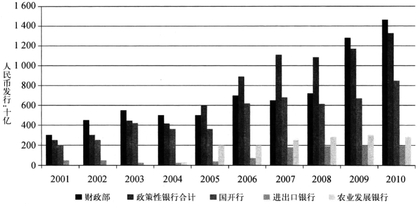
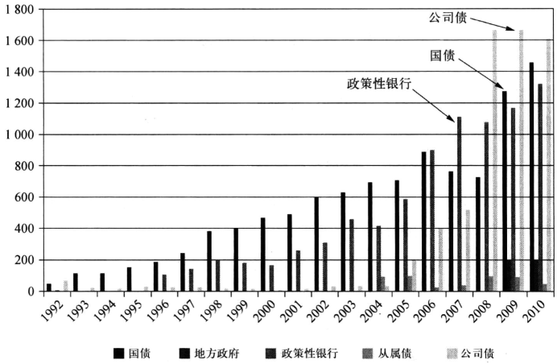
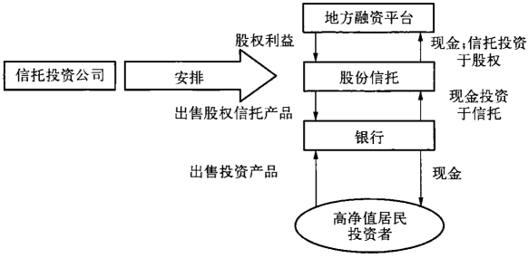
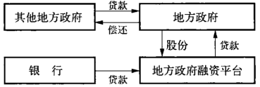
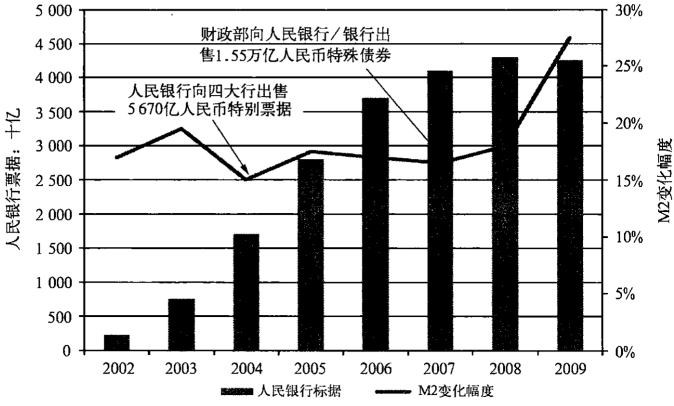
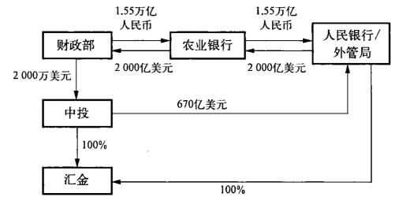
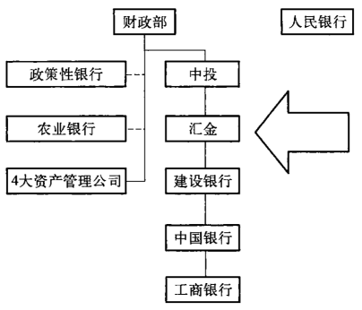
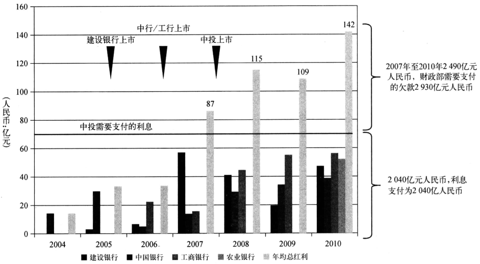
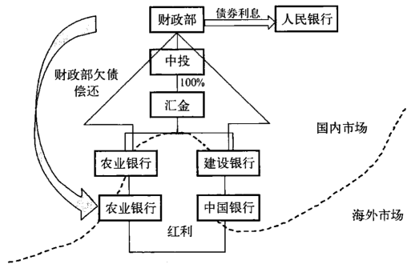
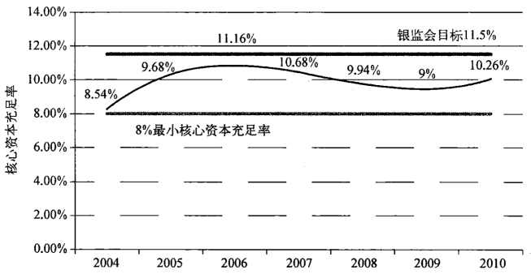

# 第五章 中国债券市场上的纠葛

    “中国应避免支付高水平的股息，令到银行经常地向市场
    集资……中国应该积极拓展人民币债券的发行并且鼓励那些
    需要充实资本的商业银行拓展海外市场融资渠道。”

                        ——项俊波，中国农业银行董事长
                        2011年7月18日
[^5-1]

[^5-1]: 《华尔街日报》，2011年7月18日。

银行重组和从2001年年中以来股市的逐步下滑，对中国债券市场的发
展反而起到了促进作用。这个阶段从2002年年初，周小川被任命为中国人
民银行行长开始。那一年，总共发行了9330亿元人民币（约合1130亿美
元)的债券，其中大部分是国债和政策性银行债券。到2009年，发行数量翻
了三番，达到了2.8万亿元人民币（约合3500亿美元），并且从种类上也包
括了大量的公司债和银行债。到该年年底，中国债券市场上流通中的债券
总量达到了17.5万亿元人民币（约合2.6万亿美元），其中，政府债券约合美
元1万亿，央行票据约合美元6290亿，政策性银行债券约合美元7940亿，
以及其他各种公司债约合美元5320亿，而投资和交易这些债券的机构投资
者数量将近9000个[^5-2]。

很多债券发行人都想从这个市场分一杯羹，而其中最迫切的要数中国
国家开发银行。正如图4－2中所示那样，国开行逐渐开始挑战这个市场中
一向占有主导地位的财政部，并且事实上也的确成为了中国的“第二财政
部”。国开行在2007年发行了6900亿元人民币的债券，而在随后的一年即
2008年，金融危机爆发，中国随之相应出台了庞大的政府刺激计划，国开行
的发行数量超过了财政部的发行数量（6380亿元人民币），占整个债券市场
份额近三成。同样重要的还有，出于对财政刺激计划的融资配合需要，中央
政府最终意识到地方政府融资的合理要求，批准了一些经济相对落后的省
份发行债券的请求。另外，各级地方政府通过它们所隶属的企业，在向银行
大规模贷款的同时也积极利用债券市场筹资人民币共6500亿元（约合950
亿美元）。

中国人民银行的固定收益证券发行量远远超过了国开债券和地方政府
债券。由于海外外币资金大量涌入中国，人民银行为了维持人民币币值而
增发人民币。从2003年开始，随着中国的贸易顺差的扩大，外国投资者蜂拥
而来，人民银行开始不断发行短期票据（有时候也会发行长期票据)来控制
国内货币供应。依靠市场化工具来调控宏观经济在中国是首创，但是人民
银行在发行票据时所面对的压力也不断增加，最后不得不求助于财政部。
中国第二个主权财富基金诞生过程中的一系列的复杂交易的背后体现了一
个事实，即最终还是由财政部得偿所愿地掌控了中国国内金融体系的要害，
这也再一次触及我们之前讲述的关于银行红利政策的内容。

[^5-2]: 此处数字总数和部分之间的差异或许来自各部门统计数据中所采取外汇汇率的差异，原
书作者并未解释。——译者注

## 国开行、财政部和四大国有商业银行

2003年，国开行在融资和贷款方面迅猛发展的同时，中国的党和政府领
导集体换届，随后国内又掀起了关于中国经济发展模式的持续争论。在这
段时间里，国开行成为了那些提倡“对内以回归计划经济为主，而对外政策
趋向于以自然资源为基础”的人口中的标杆。但是要理解国开行的地位是
件复杂的事情，原因在于一方面国开行是对银行业改革模式的一种挑战，另
一方面，国开行本身在融资能力上也受制于央行。央行不仅为其提供大量
的贷款（见图2－2），同时还拥有批准所有政策性银行每年债券发行的数量
的权力，这其中自然也包括了国开行。事实上，政策性银行一向被认为和央
行是站在同一条战线上的，陈元在1994年国开行成立之前一直担任人民银
行副行长。在这一时期政策性银行债券，尤其是国开行债券发行量的猛增，
正支持了这样的观点。

陈元，这位雄心勃勃的国开行的创始人，一心想让国开行模式取代四大
行的模式。在周小川的改革方案中，四大行进行的改革是依据国际银行的
模式开展的，包括了有意从国际大行中引入战略投资者。而陈元则提出“还
是要围绕我们自己的需要，来构造自己的金融体系”，其中特别强调了“我们
的金融体系首先要为快速增长的经济提供资金，解决企业的各种融资瓶颈，
为各种类型的企业提供充分的融资渠道[^5-3]。”

[^5-3]: 《经济观察报》，2009年7月20日。

国开行所投资的项目，一度是被纳入国家财政预算的，现在变成了独立
于财政体系之外的了，因此国开行可以依据自身的商业原则在一定程度范
围内决定投资哪些项目，不投资哪些项目。尽管如此，这些项目仍然是国
家项目，因此国开行的负债也仍然是国家的负债。国开行和四大行不同之
处在于建立之初就是一个部级单位，拥有半独立的性质，直接向国务院汇
报，这不是建立在一般治理机制之上的。陈元的父亲，陈云提出的“鸟笼”
理论为1980年代经济特区的建立奠定了理论的基础。党内相对保守的人
可以接受允许外商投资的一个前提条件，就是这些投资只能在限定的区域
以内。这个曾经很有说服力的政治观念现在已经与时俱进了，更多讨论的
是体制内和体制外之间的区别。对陈元来说，他的目标是把国开行建设成
囊括投资银行、证券公司于一身的全能型银行（尽管这种“美国模式”是他
反对的）。如果国开行能够成为一个全能型银行，就不难理解为什么四大
行出于防御性的目的，试图从各自的资产管理公司手里把经营许可给拿
过来。

如果这个想法真的实现了的话，那么按照陈元对国开行设计的这条道
路，中国的银行体系将会回到改革前“中国人民建设银行”的时代。中国人
民建设银行不同于现在的中国建设银行，当时是隶属于财政部的一个部门，
它和国开行类似，为经济提供长期资本服务。不同的是，国并行具有现代企
业的形式和公共关系的专业能力，后者在其网站上将陈元很久之前说过的
标语性口号添置为网站背景。然而这些并非最重要的差异。中国人民建设
银行的资金来源是财政预算，并且代表财政部将免除利息的投资资金注入
国有企业和那些被列人国家计划中的基础建设项目中，而国并行的资金却
不依赖财政预算。

作为一个政策性银行，国开行的资金需要从债券市场上依靠发行债券
获得，可是中国的债券市场对商业银行和人民银行的依赖性很高。国开行
大约72%的融资来自商业银行。如图5－1所示，从2005年开始，国开行的
债券发行数量就迅速增加。

由于银行是所有资金的来源，如果这种状况继续下去的话，债券市场
很快就会饱和，事实上，市场在2011年中的确达到过饱和，从那个时候开
始，国开行债券的每次发行就会相对压缩财政部债券的发行数量，如图
5－1所示。有哪一家机构可以同时和财政部和四大行相抗衡吗？答案是
否定的。

注：2007年财政部发行的债券中不包括1.55万亿人民币的中投特殊债券；2009年财政部发
行数量也不包括2000亿人民币的地方政府债券。

资料来源：《中国债券》

在追求更大规模的同时，陈元其实也对商业银行表面上的现代化感到
憧憬。这种憧憬促使他打造中国第一家全能银行并且公开上市。他在追求
这个目标的时候很明显受到了某种鼓励，在2008年12月11日，国开行成为
股份制银行，为准备上市迈出了第一步。但是问题在于：为什么国务院要将
一家政策性银行，一家从最初设计上就是专门为国家计划内的基础建设项
目提供非商业性投资的机构变成一家商业性机构，然后还要上市呢？陈元
的观点是商业化并不会改变政策性银行的银行经营战略：我们由此可以得
到的教训是，国际一流银行不应该只以西方最好的银行为标准，而是要有一
个国际的客观标准……国际一流银行首先要健康，这表现为要有优质的资
产，获得市场上投资者的信任，而且要对社会问题有客观、公正和深入的理
解，为解决社会问题付出一定的努力，并获得公众的赏识。[^5-4]

[^5-4]: 《经济观察报》，2008年7月20日。
[^5-5]: 《经济观察报》，2010年1月11日。

国开行的模式，强调了社会公平的问题，这对过去15年间以利润为主要
目标所开展的银行改革是个冲击，而且也基本抹去了1994年进行的政策性
银行改革的成果。尽管陈元的理论和眼光在全球金融危机的局面下可能获
得了这个国家的人民和最高领导人们的共鸣，债券市场却并未感受到这样
的共鸣[^5-5]。原因很简单：银行业监管部门对国开行的新地位并没有明确的定
义。在改制之后，国开行是否仍然保持着半官方的政策性银行地位还是已
经成为一家商业银行了？只有这个定义明确了，市场才可以对国开行在流
通中的债券进行价格判断，对未来发行的债券进行定价分析。基于不同的
答案，市场对价格的判断也将会呈现不同。这样的不确定性，既导致了国开
行和政府债券之间较大的利息差，也解释了为什么国开行的债券具有相对
活跃的二级市场。问题并不完全在于价格：如果国开行被确定为商业银行：
那它就必须像其他商业银行和保险公司那样在投资程度上受到监管的限
制，那么国开行就难以继续获得廉价融资。

国开行性质的不确定也解释了为什么其债券要比财政部债券交易更
为活跌。不确定性是风险，雄心勃勃的经营战略带来的风险对作为其投资
者的商业银行来说绝对不小。在2011年年中，商业银行持有2.9万亿元
人民币（约合4600亿美元）国开行的已发行债券，哪怕是0.5%如此小范
围的下降就会造成因为市场价格变动带来的140亿元人民币的损失（约合
23亿美元）。即便这些银行持有这些债券到到期日，就可能的损失规模而
言，这些商业银行的国际审计师们也会建议这些银行进行坏账拨备以吸收
潜在损失。

  2010年年初，当中央政府在总结2009年大规模的政府刺激计划的时
候，对外统一的口径是：“我们知道这些项目现在并不产生现金流，但是他们
对中国未来的经济发展有着至关重要的作用。”这也很好地诠释了政策性银
行的信贷功能。另一方面，这些政策性贷款在商业银行却被定义为不良贷
款。这样的定义早在1994年国开行成立和四大行在进行商业化银行改造的
时候就形成了。现在的情况是，当中国好不容易发展出来的商业银行正在
把他们自己变成政策性银行的时候，国开行却在努力成为商业银行。我们
在下面还会提到，中国投资总公司（简称中投）在2007年收购汇金的时候，也
同时收购了国开行所有的股份。颇具意味的是，国开行又回到当初成立时
候的模式——仅仅是财政部下属的一个部门。

## 中国人民银行和国家发改委

  市场主导模式并没有真正为人们所认识[^5-6]。这个模式包含的内容是，以
企业管理层决策为基础，能够直接参与以市场为基础的企业融资能力。换
句话说，企业可以选择银行贷款或者债券作为资金来源。不仅如此，他们还
将为他们的选择对股票和债券投资者负责，简单来说，就是一切参照国际资
本市场模式。为了使这个计划付诸实施，2005年，人民银行在国内股票市场
下跌的时机，抓住了一个监管上的概念漏洞“公司债”[^5-7]，这个概念把债券期
限超过一年的都纳入公司债的范畴。人民银行依据这个概念发明了一种短
期债务工具，商业票据（短期融资券），这迅速成为国企的借债选择之一。

  1993年，人民银行将公司类债务产品的归属转让给了国家计划委员会
（国家计委），根本原因是这些债务发行人在债务到期日不履行偿还的职责。
这在当时饱受争议，并且很大程度上导致了这类产品的终止。但是在2005
年，公司债再度炙手可热，原因有二，银行改革和低迷的股市。不幸的是，企
业债市场归以国家计委为前身的国家发改委管辖，企业债的承销必须由证
监会负责监管的证券公司担任。从到2005年为止的发行量（见图5－2）来
看，这两个委员会都没有对企业债这个产品太在意。从国家发改委的角度
看，债券只是项目立项之后才需要考虑的东西。项目一旦被纳入计划，资金
来源自然不是国家财政就是当地财政或者银行，债券市场发展不发展并没
有太大影响。从证监会的角度看，债券和股票之间是零和游戏，监管者从固
定收益产品或者固定收益市场上才更加可能有所收获。

[^5-6]: 李利明：《两年，中国金融生态改变了》，《经济观察报》，2005年8月29日。“2005年失败的努力”也可以参考由工商银行行长杨凯生在2010年年初发表的一篇文章，《稳定我国商业银行资本充足水平的几点思考》，《21世纪经济报道》，2010年4月13日。

[^5-7]: 在翻译“公司债”的时候很容易让人疑惑，因为有两类债：一类是由发改委所控制的，在银行间市场交易的“企业债”；另一类是证券监督委员会控制的，在证券交易所交易的公司债。周小川所发现的这个漏洞和发改委的监管有关。

注：2007年国债发行不包括1.55万亿人民币的特殊债券。

资料来源：中国人民银行，《金融稳定报告》2011年。

  我们在第四章开头作为引言的那段话，就是周小川在2005年10月所做的著
名的演讲中的一部分[^5-8]，在那段演讲中，他详细地分析了公司市场不成熟的现状。
他正确地指出，市场失效的根本原因在于指令性经济的思维作祟，“在经济转变
的早期，经济仍然是计划引导多于市场”。无论是发改委，还是以前的人民银
行，在发展债券市场问题上也的确没有尽力，而是把这个任务丢给了财政部。
当中央的“国九条”[^5-9]明确提出要发展债券市场，人民银行立即响应这个
号召，利用“一年以上”这个概念漏洞，缔造了短期融资券市场。在2005年，
短期融资券诞生的第一年，对资本已经是如饥似渴的国有企业共发行了超
过1420亿元人民币（约合170亿美元）的短期融资券（或称商业票据）。
2008年，由于发行时不再需要经过行政审批而只需要注册，发行量更是翻了
三番。人民银行的改革者们做出这样的改变也是借鉴美国的发行模式，即
发行人需要获得信用评级（这在中国需要大约三周的时间），一个承销人（银
行，不受证监会监管），发行说明书和在人民银行注册备案。为了进一步弱
化政府在这个市场中的作用，人民银行在2007年9月支持成立了一个行业
协会中国银行间市场交易商协会，以此进行行业管理。和股票市场的
不透明比起来，债券发行人以及他们的财务状况，批准文件和发行说明书都
可以在中国债券和该协会的网站上在线浏览。

[^5-8]: 周小川：《吸取教训以利再战》《中国债券市场发展高峰会上的演讲》,2005年10月20日，北京。
又见中国人民银行网站：http：//www.pbc.gov.cn/publish/hanglingdao/2950/1151/11519/
11519_, html。

[^5-9]: 这里提出的“国九条”是指2004年1月31日，针对股市连续多年低迷及市场长期积累的股
权分置的矛盾，国务院发布了《关于推进资本市场改革开放和稳定发展的若干意见》，将发
展资本市场提升到国家战略任务的高度，提出了九个方面的纲领性意见（简称“国九条”），
为资本市场的改革与发展奠定了坚实的基础。——译者注

  中国银行间市场交易商协会是个非赢利性的非政府组织，由人民银行
授权对债券资本市场的发展提出建议，对新的政策和监管法规做出支持，并
且对债券发行进行复核。在成立这个协会的时候，人民银行非常明智地设
立了一个包含了中国银行界知名人士的理事会。在这个理事会存在的短暂
时期内，这个机构成为了银行间债券市场增长最为迅速的局部市场的监管
者，这个局部市场也包括了人民币风险管理产品。当然，其权力覆盖的领域
不包括国家发改委下的企业债、金融债券以及银行的从属债，这些债务因为
对银行的影响直接并且敏感，仍然还是由人民银行直接进行监管。

  人民银行在推动商业票据之后还采取了另一个行动。2008年4月，人
民银行通过中国银行间市场交易商协会创造了一种期限在3到5年的中期
票据。和债券的一次性发行并且在市场中被持有至赎回日或者到期日的特点
不同，这种中期票据更像是商业票据，发行人可以在规定的总发行额度内根据
融资需要发行相应数量的票据。银行间市场交易商协会把这种证券称为“非
金融企业融资工具”，和发改委下属企业的企业债和证监会监管的公司债清楚
地区别开来。中期票据和商业票据一样只需要在协会备案就可以了。

  发改委却对这种文字游戏没有兴趣，声称对任何期限在一年以上的票
据都有控制权，试图终止人民银行以及中期票据的发行。国务院也接受了
发改委的申诉，延迟了这种新票据的推出达四个月之久。可是到了当年年
末，人们似乎达成了共识，即给予正确的发行人以更多的机会发行债券可以
挽救困难重重的股市，于是中期票据最终得以出台了。在随后的仅仅三个
月内，企业通过中期票据新融资达1740亿元人民币（约合260亿美元），市
场呈现爆炸性增长。到年底，共发行了6080亿元人民币的中期票据。中期
票据和商业票据加在一起，占到了2009年固定收益市场融资量的22%，即
使在2010年，这个比例也还维持在12%。

  人民银行在2005年尝试用自己的方法进行金融改革失败之后，只能以
“完善未来金融基础设施建设”的目标下，在自己的领域内发展新的金融产
品。如图4－12所示，期限较短的商业票据和中期票据吸引了非公有制经济
成分的投资者、共同基金和外资银行。在中国的债券市场上第一次出现了
由这些投资者发挥显著作用的局面，从持有数量上分别占到了商业票据的
35%和中期票据的25%。这样局部的小胜利，随着时间的推移，在环境改变
的时候可能引发重要的事件。

## 地方政府的“松绑”

  人民银行的产品创新为中国各类型的公司融资带来了新的渠道，这里
的公司不仅只包含了大家所普遍认为的国有企业。15年前认真进行的税制
改革将中央的税收和地方的税收做出了清晰的划分。从那个时候起，国企
改革和无数地方的金融机构关闭以及银行的总部化管理都使得地方政府的
融资能力大大下降。收入和支出之间的差距明显加大了。

  在2009年提交给人民代表大会的预算报告中，财政部承认，总体来说，
地方政府普遍存在财政赤字状况。报告指出，地方政府的财政总收入为5.9
万亿元人民币（约合8650亿美元），其中2.89万亿元人民币（约合4230亿
美元是来自中央政府的税收转移支付。同时，地方政府的支出为6.13万亿
元人民币（约合9000亿美元）。一位省长或者市长的日常工作中有很大的
一部分时间是在努力争取资金以支持地方经济的发展和就业机会。之前的
国企改革把运营不良的国有企业出售，将运营良好的企业挂牌上市，同时加
上吸引大规模的招商引资，给经济最发达的省份带来了希望。可是处于沿
海地区具有商业吸引力的省份毕竟只有几个。可以公开上市的国有企业数
目也是有限的，即使在持支持态度最为坚决的本国交易所里也是如此。在
亚洲金融危机之后，运行不良的国有企业被出售或者被关闭以确保地方的
资源。在这样的状况下，地方政府想要通过增加预算来应付他们的债务，只
能依靠投资项目和土地拍卖上获得的现金流，据报道，这些收入占到了地方
政府超过的预算外收入。

  2009年的全球金融危机让地方政府面临迄今为止最大的挑战：北京所
提出的4万亿元人民币（约合4860亿美元）的刺激方案，要求地方政府除了
项目立项之外，还要负责项目所需资金的。在危机之前，对金融理解深刻
的地方政府充分利用其手上的公用事业部门，公路、建筑公司和资产管理部
门，将其重组成有限责任公司。在这个外壳的包装下，地方政府可以借助这
些公司向银行借款，也可以趁债券市场改革发行债券。根据银监会的统计，
到2009年6月，省级、地区级、县级和市级的融资平台多达8221个，其中大
多数是县级，有4907个。大多数平台的建立是为了利用政府提供的免费的
贷款盛宴。毕竟，如果他们可以筹措到资金来满足北京对他们的要求，他们
当然也可以筹措更多的资金为他们自己的经济发展计划服务。在中国，有
这么一个常识，即：机会的窗口一旦被打开，也只会是稍纵即逝，聪明的人会
不惜一切代价抓紧这个机会。另一个常识是，如果政策来自中央，监管部门
就会睁一只眼闭一只眼。就这样，2009年和2010年里，地方政府获得了最
佳的融资环境，也没有人会因为他们过度融资而对他们提出质疑。

## 融资平台

  在那段时间里，地方政府和他们的融资平台获得了前所未有的借贷机
会。在经历过2008年漫长的研究讨论之后，中央政府认可了地方政府可以
存在财政赤字的情况。这个新观念的一个标志就是在2009年年初由财政部
作为地方政府的代理人发行了2000亿元人民币（约合300亿美元）的债券。
更重要的是，地方政府组建的投资公司和公共事业单位也被允许发行经发
改委审批的企业债和新型短期人民银行票据、商业票据、中期票据。利用这
一窗口打开之际，这些地方的领导迅速将他们的融资平台扩张，从最为简单
的“市（县)投资公司”扩张到其他的实体，比如水利、高速公路和能源部门。
中国的市政债券市场就此诞生了。

  在银行间市场出现的新发行人中间大约有140家由地方政府组建的实
体（见表5一1）。这些实体包括了：上海市城市建设投资开发总公司，武汉水
务集团和南京公用控股集团，这些实体和美国的市政债券发行人类似，但是
有一个不同，这些发行人除了发行长期债券以配合长期投资项目的时间，也
十分积极地发行短期商业票据和中期票据。事实上，只要是那些获得批准
可以发行的债券种类，他们似乎都会染指。

表5－1 地方融资平台债务发行，2009年6月30日

地区          发行人数量       人民币总值(十亿)       占全部地方政府比例(%)
----------  -----------   --------------------  ------------------------
1．大上海
上海                 10                  76.13                      19.4
浙江                 19                  54.1                       13.8
江苏                 13                  46.2                       11.8
安徽                 10                  14.2                        3.6
江西                  5                  10.5                        2.7
小计                 57                 201.1                       51.3
2.大北京
北京                 10                  35.4                        9.0
天津                  6                  20.1                        5.1
河北                  2                   4.2                        1.1
小计                 18                  59.7                       15.2
3．大广东
广东                  9                  25.8                        6.6
福建                  4                   7.7                        2.0
湖南                  3                   2.8                        0.7
广西                  2                   2.1                        0.5
小计                 18                  38.4                        9.8
4．西南地区
重庆                  8                  19.6                        5.0
云南                  2                   6                          1.5
四川                  3                   4                          1.0
小计                 13                  29.6                        7.5
5．中部地区
河南                  4                  12.1                        3.1
湖北                  4                   7                          1.8
山西                  3                   5                          1.3
小计                 11                  24.1                        6.2
6．西部地区
内蒙古                5                   8.4                        2.1
甘肃                  2                   2.3                        0.6
新疆                  2                   2.2                        0.6
青海                  1                   2                          0.5
宁夏                  1                   0.8                        0.2 
小计                 11                  15.7                        4.0
7．东北地区
吉林                  2                   5.2                        1.3
辽宁                  2                   4.2                        1.1
黑龙江                1                   4                          1.0
小计                  5                  13.4                        3.4
8. 其他               7                  10                          2.6
总计                140                 392                        100.0

资料来源：Wind资讯；债券包括商业票据、中期票据和企业债；发行人不包括地方制造业国企

  2009年由这些省、市和县级实体从债券市场所获得的融资达到了6500
亿元人民币（约合950亿美元），占到了企业债发行量的五成以上，占了商业
票据和中期票据发行量的48%。2009年商业票据和中期票据爆炸式的增长
则归结为审批手续的简化，不需要银行的担保，同时发行只需要在银行间市
场交易商协会注册备案。对发行人更为吸引的是，中期票据的承销费用和
利息费用比发改委负责审批的债券以及银行贷款要低。2009年是地方政府
“暴富”的一年。如果我们仔细看一下这些地方政府发行人的地域分布的
话，我们可以发现，其实这里面存在地域局限性；66%的地方政府发行人和
76%的融得资本来自中国最富裕的地区：大上海、大北京和大广东地区。怎
么来解释作为中国经济最富裕省份的浙江省拥有19个地方政府发行人，甚
至是到了县的级别，而河南省作为中国人口最多的省份却只拥有4个地方政
府发行人？答案似乎很简单：钱生钱。

  因此，其他8000多个“没那么好运”的地方政府，则和以往一样,需要借助他
们和银行在地方分支机构的关系来举债。如果这些政府资源已经很有限了，他
们又如何借得资本呢？图5－3展示了地方政府利用融资平台的一种方式是把
土地和税收补助资本化，土地可以作为发行债券或者银行贷款的抵押物。

资料来源：基于《亚洲金融》2009年6月，32期

  土地的价值越高，融资平台获得资金的能力也越强。抵押的土地可以被
用来进行大型的发展项目，比如住房、办公大楼或者购物中心。当地经济越发
达，这些发展项目的预期效益也越大，投资人也更有兴趣参与投资融资平台，其
参与方式多为高净值客户从信托公司那里购买其设计的理财产品（见图5－4）。

  可是在中国很多的地方，这样的机会并不存在。债券市场里所要求的
最基本的条件他们也无法满足，因此这些地方政府只能和往常一样从银行
贷款。于是他们走捷径。例如，图5－5 描述了一个地方政府是如何向另一
个地方政府借款，并将资金注入其融资平台的。等到资本被注册，公司也成
立了，这个地方政府就将钱取回，偿还给借出款的政府。融资平台照样存
在，有符合规范的注册资本和营业执照，完全符合资格向银行贷款，只是并
没有真正的资本。

  人民银行和银监会的调查显示，类似的地方政府融资平台到2009年9
月底总债务达6万亿元人民币（约合8800亿美元），其中近90%的经济刺激
项目依赖银行贷款[^5-10]。在相同的调查报告里也注意到，这些贷款总共是地方
政府收入的2.4倍，在29个省和自治区中有13个地方政府的负债已经超过
了他们的总财政收入。银监会还发现，2009年，这些地方政府的贷款占了总
贷款量的14%，对于某些银行来说，它们占到了当年新增信贷的40%。

[^5-10]: 方会磊，张曼，于宁，张宇哲：《5万亿之忧》，《财新》杂志在线，2010年2月5日；［美」史宗瀚（VictorShih）：《地方政府债务：大冰糖山》，《中国经济季刊》14（2），2010年6月。

  到2009年年底，中央政府已经公开承认地方政府总计7.8万亿元人民币
（约合1.14万亿美元)的债务。在经过了又一年无节制的信贷扩张之后，国家
审计署在第一份关于此问题的详细报告中显示,到2010年年底为止，地方政府
的债务达到了10.7万亿元人民币，其中近八成是银行贷款（见表5－2）。

表5-2 地方政府融资来源和类型,2010财政年度

---------------   -------------  -----  --------------  --------  -------  -----
资金来源            政府直接负债      %    政府担保负债       其他     总计      %
---------------   -------------  -----  --------------  --------  -------  -----
银行贷款                 5022.5   74.9         1913.4      1532.1   8468.0  79.0

债券                      551.1    8.2          106.7       98.9    756.7   7.1

上一级政府补充            213.1    3.2          234.7        0.0    447.8   4.2

向其他部门
个人贷款                  924.2   13.8           82.2       38.6   1045.0   9.8

合计                     6710.9  100.0         2337.0     1669.6  10717.5 100.0
---------------   -------------  -----  --------------  --------  -------  -----

资料来源：国家审计署

  根据审计署的数字，地方政府在 2009和2010年的两年里，直接或者通
过其下属机构借款总额相当于中国的国内生产总值的27%。没有什么比一
句中国的谚语更能形容这种融资现象了：“只争朝夕”。至于信贷质量，中国
国际金融有限公司（中金)的分析师如此评论，“如果这些融资平台的资金链
没有断裂，他们可以在当前的经济发展形势下化解潜在的信用风险。”[^5-11]换句
话说，只要银行继续放贷，到期偿还就不会有问题。不幸的是，2010年中，银
监会禁止银行将贷款到期展期或者滚动偿还。尽管银监会意识到有40%的
地方政府债务在2012年底之前到期，并且有高达24%的地方政府债可能出
现问题，但还是出台了这项政策。不过，要解决银监会政策出台所造成的这
个障碍还是有其他的办法。

[^5-11]: 《21世纪经济报道》，2010年4月12日。

[^5-12]: ［美」卡尔·沃特(Carl E·Walter)，弗雷泽·豪伊(Fraser J．T.Howie)：《北京：金融的末日审判日正在来临》，《华尔街日报》，2011年6月21日。又见《华尔街日报》中文版网站：www.wsj.com.在这篇文章里，我们注意到用来处理不良贷款的方式已经以资产管理公司的形式和财政部的欠条方式存在了。当然，银行也可以被要求把这些坏帐一笔勾销。

  央行提出的解决办法一点不让人感到惊讶，这就是允许省级政府发行
债券（有别于通过财政部发行债券，见下一小节）。出售债券的收入可以用
来偿还地方政府的债务[^5-12]。这一章已经揭示了债券其实是银行贷款的一种
包装形式而已。如果中国的市政债券获得批准，那么将债券出售给大规模
的国有银行所带来的收入无疑将会被用来偿还那些小规模银行和国开行的
贷款。这也是另一种形式的银行红利。在当期贷款到期时将其滚动到下一
期贷款，也就是用新债还旧债。

## 信用加强

  看看中国的信用评级机构的作为是否会在揭示债券市场的潜在信用问
题方面提供一些线索呢？对于一个几乎所有债券发行人都属于政府机构直
属的债券市场而言，信用评级的问题其实说复杂也不复杂，说简单也不简
单。毕竟，如果理论上所有的一切都是国家所有，这些发行实体的信用评级
又怎么会各有千秋呢？中国的五大信用评级机构（如表5－3)又将是如何对
一个省的信用风险和另一个省区别对待，在一家国有银行和另一家国有银
行之间区分信用质量的呢？从投资者的角度来说，这个问题是非常现实的，
因为商业票据和中期票据的一个吸引入之处就是发行人只需要获得评级机
构的评级就可以。但是如果所有国有实体都是一样的评级，那么评级也就
失去了意义。当然，前提是投资者，绝大多数也有国有的背景，对国家信用
担保还是很看重的。这也就是为什么到今天为止，中国的信用评级还是一
个难以解决的问题。

表5-3 中国的信用评级机构

名称                  地点                      投资人
-----------------    -------------------       ------------------
中诚信                北京                      穆迪（少数持股）
联合                  北京                      惠誉（少数持股）
大公                  北京                      全部国有
上海新世纪            上海                      全部国有
远东                  上海                      新华财经

  发改委对这个问题的解决却采取了直截了当的方法：隶属其管理范围
内的企业债一概需要担保。提出这个要求是有历史渊源的。在20世纪80
年代末，国有企业刚开始被允许发行债券的时候，在债券到期的时候，这些
企业都拒绝偿付，理由是借的都是国家的钱。这个事实表明了国有企业的
信用风险十分高。如今，保监会只允许受其监管的保险公司投资发改委批
准享有担保的债券。这样在企业拒绝支付的时候，担保方可以确保本金的
偿付。但是提供担保的一方形色各异，保险公司作为投资人如何对经发改
委批准的不同债券担保人做出甄别呢？这里就需要用到信用评级了。因
此，发改委审批的债券，人民银行和银行间市场交易商协会的商业票据和中
期票据，就在很大程度上依赖信用评级机构的评价了。但是正如现在国际
市场上也意识到的那样，信用评级机构也不总是正确的。

  那么中国的评级机构的信用判断的效果如何呢？表5－4中的数据展示
了AAA，AA和A级的企业债发行人和他们相应的担保人和信用评级机
构。由于所有的担保人都类似，债券的条款又在很大程度上相似，担保方的
信用评级就直接体现在债券发行人身上。举例来说，如果担保方是国开行，
那么任何发行人都应该获得AAA的评级，因为在发行人违约的情况下，国
开行将会代为支付本金和利息。如果这些评级是合理的话，那么我们做出
如下的结论也是合理的，即没有担保的商业票据和中期票据的发行人的信
用级别在中国的环境下也是可以推断出来的。

表5-4 企业债券发行人信用评级和担保人评级

发行人：AAA                  AA                       A
-------------------------    -----------------------  ---------------------------
1 上海久事公司                1 福建发展高速公路        1 广州造纸集团
2 国家电网                    2 山东电力集团            2 上虞城市交通投资公司
3 北京基础设施投资有限公司     3 大连港集团              3 衢州城市交通投资公司
4 中关村高科技中小企业         4 武汉钢铁                4 中国盐业总公司
担保人/评级机构：
1 国开行/大公                 1 国开行/中诚信           1 建设银行广东省分行/联合
2 中国银行/联合               2 国开行/远东             2 农业银行浙江省分行/联合
3 建设银行北京分行/中诚信     3 建设银行大连分行/中诚信  3 全柴动力集团/大公
4 建设银行湖北省分行/联合     4 建设银行北京分行/中诚信  4 中关村科技担保公司/联合

资料来源：Wind资讯，2009年6月30日

  不幸的是，按照国际标准来看，任何有头脑的投资者都会觉得这些信用
评级不是那么可靠。比方说，一个由AAA级别、半政府性质的政策性银行
提供担保的实体所获得的信用评级怎么反而会低于AAA级别，就好像福建
高速公路和山东电力的AA级别的例子。再举个例子，联合信用评级公司对
建设银行湖北省分行的评级是AAA级别，这很合理，因为分行是建设银行系
统内不可分割的一部分。但是由建设银行广东省分行所担保的广州纸业的评
级仅为A，可是同属于建设银行系统的大连市分行担保的大连港却有AA的级
别,这就很难理解了。更糟糕的是，这么一个广东省分行的担保效果看上去和
北京郊区的一家小型担保公司中关村科技担保公司的差不多。

  如何解释这个让人迷惑不解的现象呢？这其中有多种可能性。比如说，
信用评级机构可能把银行当作是一些独立支行的集合。正如某位市场参与者
所说，“这些银行在全国范围有一万多家分行。重庆分行行长眼里的上司是当
地的党委书记，并非在北京的总行上级。”按照这个观点进行评级产生的问题
在于，评级机构需要十分了解地方分行运作，可是这种可能性却不高。另一个
可能性是评级由发行人支付的佣金决定。评级可以用来买卖这在市场上是屡
见不鲜的。但是更有可能的情况是，即使市场和其他中介的架构已经存在，投
资者信心的来源仍然还是来自相信政府会干涉防止违约发生。这也可以解释
为什么来自中国某证券公司风险部门的主管会表示“所有机构和他们的信用
评级都是正确的”。以上的可能性在各个层面上都不能让人完全信服。

## 省级政府的半主权债务

  如前所述，2009年3月，财政部发行2000亿元人民市（约合300亿美
元)的地方政府债券。这些债券是在仓促间出台的，以至于监管的框架还没
有来得及构思好，对他们的信用评级到底如何进行尚未有很清晰的规划。
这背后的思路大体上是这样的：省级政府在中国的行政序列上是和部委同
等级别的，也代表了国家，因此应该享有和国家主权同等的信用评级。但是
一个很明显的事实是青海省和上海市还是有很大的差别的。

  财政部的发言人则称，这些债务是以省政府的名义发行并且也确实是
在省政府财政预算中的，财政部的角色是代理人。更重要的是，财政部一再
坚称债券的利息和风险和国家发行的类似。本质上，财政部发言人就是想
让大家都相信省政府发行的债券和国家发行的相同。这可能在理论上如
此，可是在实际中，并非如此，很多市场参与者并不买这个意见的账。更有
甚者，财政部自己对于地方债务的明文规定中也并不包含相应类似的条款。
这些明文规定得很清楚，当地方政府无法偿还债务的时候，这些债务可以获
得延展一到五年的时间，而本金部分则由地方政府在能力范围内分期偿还。
简单来说，原来期限为三年的债券可能在实际中变成八年甚至更长的债券。

  很明显，这些债务并不是中央政府的债务。尽管市场上充斥了质疑声。
这些债券在初级市场定价上却仍然和相应的财政部债券很接近。在二级市
场上价格如何很难说，因为根本没有二级市场。事实就是，这些债券淹没在
受财政部控制的这些初级市场的参与者的资产负债表里，这些参与者正是
中国的银行。

## 中国投资公司：中国金融体系中的关键

  如果说银行间市场从结构上或多或少有点象金字塔的样子，这个市场
的存在对于人民银行运用货币政策调控通货膨胀具有异乎寻常的重要作
用。2002年，关于如何应对严重通货膨胀威胁的政策大讨论开展得如火如
荼。中国的固定资产投资受到“入世”的鼓舞，从2002年就开始以年增长幅
度达31%的速度呈现井喷式增长，这是自1993年以来到达的一个高潮（见
图5－6）。人民银行对20世纪90年代中期两位数的通货膨胀率记忆犹新，
于是人行在解放以来首次持续不断地向市场发行短期票据。2002年最初的发
行量约合260亿美元，随后的几年逐年增加，到了2007年，人民银行从银行手
中回收了近6000亿美元的资金。在这期间，央行九次抬高了存款准备金比
率,五次提高利率。如此猛烈的用药只是在短时期内奏效，到了2007年,外汇
储备的激增和随后产生的新增货币都给体系留下了难以逾越的挑战。

资料来源：中国人民银行，《金融稳定报告》

  很多人还记得1993年朱镕基为了干预经济是如何先发制人利用行政命
令的方式禁止一切流动性注入体系的。朱镕基所做的就是将银行的大门关
上，使中国经济进入了三年的冷却期，直到通货膨胀从1995年顶峰时一度超
过20%下降到可以接受的范围。2002年主张采用行政手段干预的一派认
为，并非整个经济体都过热，只是其中的几个工业部门，这需要采用针对性
的政策手段来对待。这种观点占了上风，对这些工业部门的银行信贷被终
止。到2004年，这样的努力及时缩减了投资的增长和基础货市（M2）的规
模，这里的“及时”体现在随后不久，中国蓬勃的贸易顺差带来了洪水般流入
的美元。

  就在这个时候，2005年7月，人民银行终于说服政府放弃人民币和美元
的挂钩，并且允许其缓慢升值。不幸的是，人们对人民币预期升值20%的说
法的深信不疑，带来了热钱的潮水般涌入，国内资本市场的流动性急剧增
加，更别提由此带来的股票指数急速上扬和对高端房地产市场的投机行为。
人民银行和政府在较早前防止通货膨胀所采取的措施取得了成果，却在
2008年全球金融危机爆发之后让形势变得更复杂，尤其是当市场的走向完
全背离了政治期望的时候，尽管人民银行作出了最大的尝试试图控制涌入
的“热钱”。图5－7中的数据表明，短期票据的有效性在2007年之后开始下
降。用M2来衡量的货币供应增长一直维持在16%附近，可是在2008年这
个数字变成了18%，2009年则成为了29%。从人民银行角度上讲，当出口
的增长在2008年年底出现下降的时候，人民币升值的目标就马上被搁置了。

资料来源：人民银行，《金融稳定报告》；《中国债券》

  这是从2002年以来围绕中国金融框架的政策争论的宏观经济背景。争
论的焦点最后归结到2007年组建成立的中国投资公司（中投）。具有讽刺意
味的是，这个主权财富基金成立的初衷是将中国积累的外汇储备进行海外
投资，而实际上最终却戏剧化地被用来重塑中国的金融体系。中投并非中
国的第一个主权财富基金。中国华安投资有限公司，作为外管局在中国香
港的一个下属公司，就从1997年以来十分积极地参与对部分中国外汇储备
的管理。那么为什么还需要第二个类似的基金呢？华安是隶属于人民银行
的；中投却是隶属于财政部的。为什么财政部要涉足外汇这一个长期以来
一直都在人民银行清晰管辖范围内的领域呢？答案似乎是这样的，由于人
民银行从财政部接手了对四家主要国有商业银行中的两家的控制权，财政
部自然有理由从人民银行那里获得某种补偿。最终，中投的成立更多是
次关于行政管辖范围的调整而不是主权财富基金本身。这个回合的较量的
结果很显然：中投成为了中国国内金融体系中的关键。

## 人民币冲销和中投

  中投资本化的事件表明，在中国任何制度上的安排都不是永久性的：任
何事情都有可能随着环境的改变和权力的制衡而改变。所有的制度，不管
新老或者重要与否，都可以发挥作用。中投的例子同时也表明了来自巨额
外汇失衡的压力给这个国家的金融市场体系所造成的扭曲。这种扭曲，现
在已经不仅仅局限于中国的债券和股票市场了，而是蔓延到了金融机构，而
这些金融机构则是国际股票市场及其投资者们所依赖的基石。

  因其成立的初裹是将外汇储备投资海外，关于中投的资本来源人们起初
或许会认为是来自外汇储备，与国有银行的资本来源类似。中、农、工、建四大
行的资本至少都受到外汇储备的补充，这主要是通过人民银行创立的汇金公
司来完成的。2007年，急剧增加的货币供应引发了人们对资产泡沫的担忧，同
时也引发了财政部和人民银行之间到底是通过货币工具还是行政手段直接干
预经济来进行调控的争论。财政部认为，人民银行对外汇储备的管理回报太
小，于是财政部索性直接要求参与管理的权力并且开始考虑成立中投公司。
最后，中央还是同意给财政部一个尝试的机会，毕竟，2007年的时候，需要管理
的外汇储备还是有相当数量的。但是中投并没有获得类似当初银行直接获得
资本注入的机会，中投所依靠的是财政部的另一种特殊国债。

在2007年年初的时候，国务院就批准了这种特殊国债的发行，允许的发
行规模在1.55万亿元人民币（约合2000亿美元），分10年期和15年期两
种（见图5一8）。财政部除了指责人民银行对外汇储备管理不力之外，也抱
怨是人民银行导致了货市供应的增长从而引发了严重通货膨胀的危险。从
发行这些债券的过程也可以看出人民银行在政治上的弱势。财政部通过中
国农业银行将债券分八次发行出售给人民银行。从1994年中国人民银行法
颁布实施以来，财政部和人民银行之间不能有直接的往来。在此之前，人民
银行经常被迫直接为政府赤字提供资金支持。但是这次的债券不是为了解
决赤字。人民银行的做法是，从农业银行买得债券，然后由于这些债券的券
息都低于市场利率，于是将债券强行摊派给由银行组成的市场。这样的发
行，从银行体系获得了大量的流动性，这个流动性的数额相当于人民银行可
以从其发行的短期票据上所融得资金规模的两倍。这样的方式也可以帮助
人民银行避免了高自己短期票据的融资成本。

  虽然这个建议很有创意的成分，但是这其中并非没有任何成本，正如图
5－9中第二步所展示。财政部出于对货币政策目标的考虑，已经给予人民
银行一定的照顾，否则这样的流程早就停滞了。如果人民银行愿意的话，中
投的资本也可以由汇金公司利用外汇储备进行单独的安排。可是财政部却
最后“割肉”，用发行国债募得的资金从人民银行和外管局手里硬生生购买
了2000亿美元的外汇储备，这一购买自然又是通过农业银行来完成的。财
政部就用这些资金来组建中投。以非经济因素来衡量，这项交易的制度效
果是，使金融体系恢复到2003年前的状态，人民银行的权力和市场化阵营的
力量被弱化。但是还远不止这些。

  资金易手后，中投从各个方面看都是隶属于财政部的。虽然中投直接
对国务院负责，但是中投的高层管理人员均来自财政部系统。但是财政部
的安排中有个尴尬的技术性问题：这个特殊国债的利率如何支付？融资的
成本每年达到100亿美元。答案有些令人惊讶，中投将自己负担这些利息开
支。正如中投的领导评论的那样，中投每运行一天，就大约要背负3亿人民
币的成本负担。那么中投作为一个并非短线的投资者，又如何产生近期的
现金流以应付如此巨大的利息支出呢？解决该问题的方法进一步打消了银
行改革和拓宽金融改革的希望。

  解决问题的方法是经过深思熟虑的。在中投获得其新资本之前，这
2000亿美元的资产早已经被划入预算并且支出了，其中只有13是和主权财
富基金这个名义上的使用目的有关联。另外的2/3，大概有1340亿美元，被
花费在：一、计划内对农业银行、国开行及其他银行和金融机构的资本注
入；二、从人民银行手里立刻收购汇金。经过这一连串的动作，中投成为了
中国金融体系内的“国有资产监督和管理委员会”（见图5－10）。

  有人也许会问，为什么主权财富基金想要拥有或者投资于政府已经拥
有了的国内金融机构呢，那样资金只是在转圈圈而已？但是这恰恰解释了
所谓“体制内”是怎么回事。由中投管理层向世界所展示出来的专业性在表
面上的确很吸引人，可是真实的情况却是中投最多只能算是个“兼职”的主
权财富基金。其最重要的作用是在中国金融体系里发挥关键性的作用。经
过这次的“交易”，整个体系又被恢复到以财政部为中心同时中央银行被弱
化下的模式。

  财政部显然是这场交易的赢家，其胜利的细节可以从表3－3里看出，该
表展示了中国主要银行上市前和上市后拥有控制权的股东情况。这个结果
最终也对正在推进的银行和金融改革有着显著的负面作用。从1998年银行
改革开始，财政部和人民银行争论的焦点始终围绕着该由谁代表国家控制
国有银行。在汇金为建设银行和中国银行调整资本的时候，主要是通过建
立汇金对银行的直接经济利益所有权关系和使用财政部的资本利益来消除
不良贷款，结果是这两家银行不再隶属于财政部了。2005年财政部重新拿
回了对银行的控制权，先从工商银行开始，接着是农业银行，至少其中有一
部分原因是人民银行在管理其基本职责——通货膨胀和货币上遭遇到困
难。其实这并非唯一的原因。

  支持这次收购的行政性“逻辑”很简单：中投要自己负责这种特殊国
债的利息支付。收购银行也就意味着中投可以获得从银行上缴的红利所
得形成的现金流[^5-13]。由于他们都是属于国有性质的，这和以前有什么不同
吗？事实上是，这其中的确有一些不同，而且不同不仅仅是在涉及的行政
职能上。如果中投收购汇金，那么外管局则可以收回其最初的投资。最初
的670亿美元的投资包括了其对三家银行以及其他一些破产证券公司投
资的净现值[^5-14]。因为这仅仅是国有资产在各国有机构之间的转移，根据
政府规定，转移不需要支付资产升水。这只是会计行为，只不过是钱从
一个口袋流向另一个口袋。可是不同的股东对改革的路径却有着巨大
的影响。

[^5-13]: 使用债券和向财政部支付利息还有第二个好处，即：支付不需要中投的董事会的参与，当下属银行的现金以红利的形式流入中投之后，中投的财务官只需要在利息到期的时候进行支付就可以了；不需要董事会决议和备案。这和国资委不同。

[^5-14]: 汇金为中国银行和建设银行各支付了225亿美元，为工商银行支付了150亿美元，为其他几个证券公司支付了70亿美元。这些投资在汇金的资产负债表上仍然以支付价格陈列，即使这些银行都已经上市，而且拥有的市值远超出支付的价格。

  对中投而言，收购进展得很顺利。根据中投第一年即2008年的财务报
表来看，中投从人民银行收购的资产市值在1710亿美元，为收购所支付
的代价仅仅为670亿美元。这一数字到2009年增长到了超过2000亿美
元，不过，这个时候资产里也还包含了其他非汇金的投资资产。对汇金的
投资使得中投在第一年就可以确保盈利，也有效遏制了外界针对中投在其
他有争议性的投资里出现损失的指责，这其中包括黑石和摩根士丹利。但
是很多人会忽视这么一个细节：四家国有商业银行中的三家已经在国际
上上市。

## 中投对其拥有银行的掌握

中投除了依赖以市价计算其拥有的银行资产所形成的利润，也依赖银
行为其提供现金流来满足其支付财政部债券的利息的需要，额外的，也需要
向财政部支付红利以帮助后者可以满足其支付工商银行和农业银行所欠资
金的需要。人民银行对汇金的设计赋予了中投从银行获取红利的地位（更
多细节见第七章）。这样庞大的现金来源原本是为了帮助抵消人民银行借
款给资产管理公司以完成银行重组所产生的不良贷款。汇金的安排类似于
一种税收的形式，以逐渐减少人民银行的信贷损失同时增强其资产负债表
的质量。

  2007年年底中投收购汇金的时候，中投获得了对中国主要银行的直接
经济控制，这体现在对银行董事会的控制和在红利问题上的决定权。在所
有权、管理和人事等层面上都不加干涉（这和国资委管理的国有企业的情况
不同）。汇金过去受人民银行控制，而人民银行受党内占据较高位置的金融
领导班子控制。总体来说，现在财政部可以建议但是不能决定它需要收到
的资金数量。

  这需要我们回到银行上市来了解整个来龙去脉。三家银行派息率在
50%左右，这按照国际惯例来说并不算过高，不过国际惯例所说的银行是，
按照稳定速度增长，在正常的商业环境中即不良贷款和证券损失并不显著
的情况下。可是，这显然不符合中国的银行的状况。这些银行通常为了支
持国家经济增长每年都要增加20%左右的贷款，某些年份比如2009年，新
增加贷款则更多。但是从2008年开始，汇金的新任务是帮助中投支付财政
部债券的利息和帮助后者偿还负债。由于银行是公开上市企业，并且受国
际会计师事务所审计，现金红利是信息透明的。某种程度上，他们是一种可
以信赖的指标，体现了政府对这些银行的态度。

  在重组的早期，当不良贷款被剥离给资产管理公司的时候，资产的增加
幅度受到严格的控制（见图3－10，2001一2005银行贷款），资本比率提高很
迅速。当这三家银行各自上市之后，贷款、利润和红利都迅速增长，尤其是
当2007年中投收购了汇金之后。从那个时候起，红利支付的水平一下子就
被提高到可以满足中投支付利息的需要，同时还有充分的空间以保证财政
部将需要支付工商银行关于重组的欠债从1430亿元人民市（约合180亿美
元）减少到620亿元人民币，到2010年，财政部欠工商银行的债务全部结清。
当然，因为中投和其拥有的银行负责支付这些费用，国家财政预算的负担也
相应地减轻了。

  这些金融上的安排（见图5一12）也为将来中国的银行改革往何处去提
出了问题。从2009年的经验来看，银行已经重新回到以前的商业模式成了
不争的事实。但是对红利政策的设置仅仅是为了满足财政部自己的需求。
更糟糕的是，在这一时期所支付的红利都是来自银行上市所募集的资金（见
第二章的讨论）。从最基本的角度看，国际和国内的投资者们将420亿美元
的资金交给银行，然后这些资金间接地流入了财政部，而这些投资者在那些
年获得的红利只有不到80亿美元（见图2－8）。更深层次的问题是，在维系
支付红利能力的压力之下，银行的管理层是否不得不增加贷款？因为在存
贷利率差固定的情况下，更多的贷款就意味着更多的利润，更多的红利，更
好的股票价格和在《财富》杂志全球500强里更高的排名。随后出台的经济
刺激方案恰恰为这个提供了最好的理由。

[^5-15]

资料来源：汇金；银行H股财务报表

[^5-15]: 图中原作者在计算2010年的数字时候漏算了农业银行的现金红利，这里由译者纠正了。——译者注

  不到一年的时间里，在2010年年初，50%的派息率和贷款量的肆意增长
给银行造成了不小的挑战。其中面临挑战最为严峻的是中国银行，其贷款
在2009年增长了43%，其他银行则仅仅增长了20%多点。高派息和资产
增长，导致银行的资本基础受到侵蚀，中国银行和工商银行的资本比率很快
就逼近他们上市前的水平了（见表5－5）。

表5－5 核心资本充足率趋势，2004一2010年

%           2004   2005   2006   2007   2008   2009   2010
---------- -----  -----  -----  -----  -----  -----  -----
建设银行     8.06  11.08   9.92  10.37  10.17   9.31  10.40
中国银行     8.48   8.08  11.44  10.67  10.81   9.07  10.90
工商银行      --    9.89  12.12  10.99  10.75   9.86   9.97  
农业银行      --     --     --     --    8.04   7.74   9.75

资料来源：银行H股年报

  从那个时候起，政府就为如何增加银行的资本储备而弄得焦头烂额。
2010年年初，每家银行都公布了创纪录的2009年收益和改善的不良贷款比
率，紧接着却是一家随着一家宣布再次上市融资550亿美元的计划，这是他
们之前上市所募集所得，然后上交给了财政部的资金额（见表2－3）。当然
如果国家想维持其股东的地位也必须增资。正因为此，当关于作为这些主
要银行的最大股东汇金为了保持其在银行股份中的比例和所有权地位，试
图申请最高可达500亿美元的庞大资本注入的谣言传出来的时候，并没有让
人感到意外[^5-16]。更有意思的是，中投也向财政部申请额外的2000亿美元。
两个申请的最终获批的金额都被显著地削减，汇金获得最高限度为1900亿
元人民币（约合280亿美元）债券发行，而中投则获得限度1000亿美元。汇
金于是从2010年8月开始对外发行总共1900元亿人民币元的债券，到
2011年年底之前分阶段发行。第一阶段的540亿元人民币的发行在银行投
资者对汇金的强索行为纷纷发出无可奈何的抱怨中完成。2010年一共发行
了1090亿元人民币（约合166亿美元）的债券。为了支持中国银行、建设银
行和工商银行2011年的二次上市，汇金需要950亿元人民币（约合146亿美
元)来确保汇金（国家)的股东地位不被稀释。又一次，一个代表国家的股东
通过将债券出售给受其自身控制的银行来获得融资，这一交易过程和1999
年财政部特殊国债并无太大差别。

  红利，过度的放贷和对资本的渴求，至少有部分原因是被财政部从人民
银行收购银行资产所赐。如果中投当初直接由外汇储备来提供资本，中投
就可以维持其纯粹的主权财富基金的地位，财政部的投资也只是和外管局
投资相互比肩而已。即使需要冲销数量庞大的人民币，特殊债券也可以单
独发行。但是财政部将二者合为一体，结果形成的这个结构将中国金融体
系的核心扭曲成如今这个无论从行政上还是经济上都面临尴尬处境的
地位。

[^5-16]: 汇金的债券谣言最初是在2009年11月传出的。见《华尔街日报》，2010年8月11日。

  在2010年召开的第四次全国金融工作会议的议题中可能最大的一个议
题就是如何处理汇金。并不让人感到意外的是，即使在过了一年后，也没有
提出任何解决问题的方案。财政部是希望以汇金作为“金融国资委”的基
础，最终成为中国整个金融体系的超级监管者，以代替现行的“一行三会”的
监管结构[^5-17]。即便这一切将会发生，汇金脱离中投，特殊国债的这种安排却
很有可能依然存在。那么问题就来了，究竟哪个实体应该向中投支付这900
亿美元，作为汇金正常的价值，使其脱离中投所要支付的资金又将从哪里来
呢？问题的焦点是汇金和其拥有的银行将继续成为这场“官僚式乒乓球拉
锯赛”的对象，这些在国际上市的银行正越来越多地受到国际投资者对其价
值的关注和判断，可是同时，中国政府却正积极地致力于减少这些银行受到
的来自外部的影响。

[^5-17]: 这是指中国人民银行，证监会，银监会和保监会，关于其背景，可以参考《经济观察报》，2010年7月12日。

## 金融市场的周期

  众所周知，中国现行的将人民币和美元汇率固定的货市政策极大地限
制了利率。这也意味着真正的固定收益市场得不到发展。这个问题还有另
一个方面。中国银行业的盈利能力有赖于规定的存款和贷款利率之间的最
小利率差。从企业借款人那里获得的利润可以帮助他们支援政府债券的购
买。要确保这样的模式继续，就需要国内垄断地位受到保护，不受外部压力
的干扰。外资银行在中国存在的意义只是表示开放市场的一个象征。由于
利润是确定的，银行从来不需要为了获得客户而创造什么。他们也不需要
担心新的资本或者问题贷款：这是政府的问题，不是银行管理层的问题。因
此当政府提出要发展债券市场的时候，银行都响应号召，债券只不过就是披
着外衣的贷款而已。公司债券市场停滞了：缺乏二级市场。但是固定收益
市场并不止只有公司债。

近年来，人民银行面对庞大贸易顺差和其所带来的美元外汇涌入，出于
维持汇率稳定的考虑不得不新发行大量的人民币，同时人民银行也不得不
针对此过程中所引发的通货膨胀和资产泡沫对多余人民币采取冲销手段，
可是这么一来，金融体系得以安身立命的基本原则，即基于市场的原则被扭
曲了。当2007年财政部提出人民银行发行的票据不足以抵消多余的人民币
的时候，给出的解决方案直接导致了中投公司的建立。中投的建立至少解
决了两个主要问题：临时性的控制货币生成和大量使用国家积累的外汇储
备。这是个聪明的解决方案，可是由于中投收购汇金变得复杂了许多。

  利用汇金旗下的银行来支付财政部债券的利息乍看似乎是个好主意，
中央政府对银行资本充足和财务稳健也深信不疑。但是这将中国国内金融
市场所面临的压力和国际金融市场联系在一起，产生了和体系基本利益背
道而驰的经济风险。要满足当前货币不可自由兑换、固定的汇率和利率、依
赖银行的积极贷款促进经济增长这些需求都意味着需要大量新的银行资
本，而这些新的银行资本的补充则需要依靠国际和国内的资本市场。鉴于
需要募集的新资本达到了700亿美元，市场最终会要求其价格能够体现真正
的供求关系，而未必能像中国农业银行上市成功募集200亿美元那样得到很
多国际和国内朋友的帮助。

  现在回过头来再看，过度的经济刺激计划给予了银行过于自由的权力
来扩大他们的放贷规模。但是不管有没有刺激计划，正如历史证明了的，这
是国有的银行在任何情形下都会做的事情（见图5－13）。因为规定的存贷
款利率差，10万亿元人民币（约合1.5万亿美元）的新增贷款极大地增加了
银行的利润。值得注意的是，银行在给地方政府提供贷款的时候是很乐意
的，尤其当任务是由地方党委书记布置的时候，这样的贷款可以是直接或者
通过债券的方式。地方政府会破产吗？他们和国有企业比起来信用风险是
否少一些呢？2010年四大银行的报告显示，他们有创纪录的利润，高额的坏
账准备金和因为贷款扩张而下降到2%以下的不良贷款率。这都是基于最
简单的数学运算，并非管理层的卓越表现或者价值创造。可以预期的是，他
们的派息也将创纪录，其在《财富》杂志全球500强里的排名将节节上升。但
是贷款的扩张减少了银行的资本。21世纪的第一个十年结束了，尽管这些
银行的财务报表很漂亮，可是正如20世纪的最后三个十年里一样，中国的银
行仍然迫切需要资本的再注入。

注：比率是以四大行在第一个周期的资本充足率平均值计算的。

  这也代表了中国现金机器完整的一个周期，这一周期花了十年。但是
什么情况下按照体制内的思路来出牌和什么时候又表现得遵守国际惯例和
监管规则的这样一个断层越来越清晰。下一个周期现在就几乎可以很肯定
地看出来，并且我们也知道为什么真正的变革不太可能。规定的存贷利率
差确保了银行的利润，因此也确保了可以派发给投资者的红利，比如汇金。
汇金，随后必须满足中投的要求，而中投则必须满足财政部特殊国债的要
求。在工商银行和农业银行欠债上，财政部也必须为之前做出的资金承诺
作出兑现。即使汇金脱离中投，也只是需要再设置一条将现金从银行输送
到财政部，再由财政部输送给银行的途径，金融的架构已经在那里了。只要
中国的出口和非公经济仍然相对薄弱，银行依旧需要扩大贷款以促进经济
快速增长。

  那么，中央又如何允许银行被资本市场或者来自外部的真正市场竞争
来造成金融脱媒呢？采取保护性措施，强调谨慎监管，控制汇率和固定的存
贷利率差，这些都确保了政府对银行的控制和体系的稳定。还有一点也几
乎可以保证，那就是银行每隔几年一周期需要重新获取新的资本。从外部
看，银行的利润让存款人相信他们的银行很稳健，他们的存款很安全。国际
投资者也支持银行的股票，因为银行股被视为银行业驱动下的国民生产总
值的最好代表。银行利用居民存款和新的注入资本来发放新的贷款以促进
经济增长并且让人相信中国的债券资本市场正在向西方市场体系靠拢。

  中国落后的债券市场并没有给银行减少风险负担，而是制造了新的风
险。这些债券占到了四大银行总资产的25%一30%，因为这些债券是负利
率差，因此，给银行带来了很显著的市场风险。为了抵消这些风险，银行最
终只好增加贷款，从而增加信用风险。这样一来，发生资产泡沫、股市泡沫
和问题贷款的几率大大增加。对待这些问题的方法，比如资产管理公司、财
政部的资金承诺和人民银行的信贷支持都已经存在。正如第一代不良贷款
的处理那样，这些方法只是抑制了问题，将最终会暴露的问题延缓发生，希
望可以无限期地推迟，并且淡出国际观察家的视野。这样，在体制内部生成
的周期和压力还会持续很长的一段时间。

